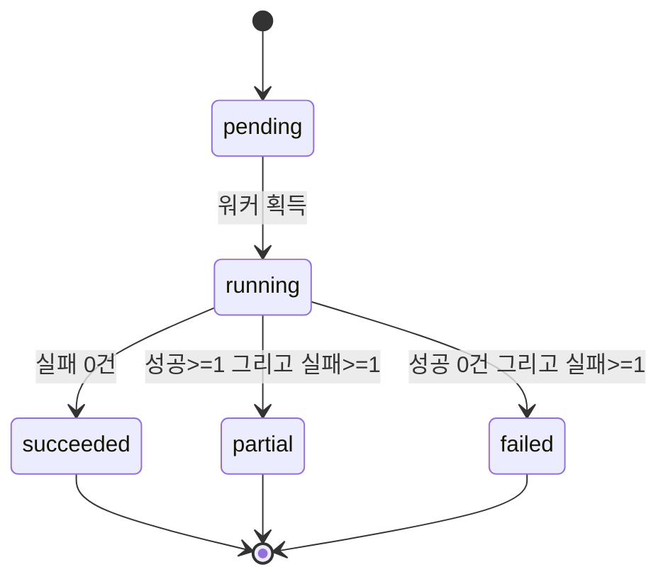
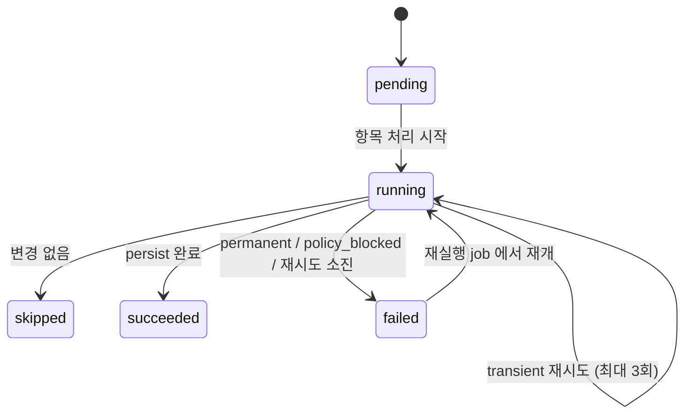
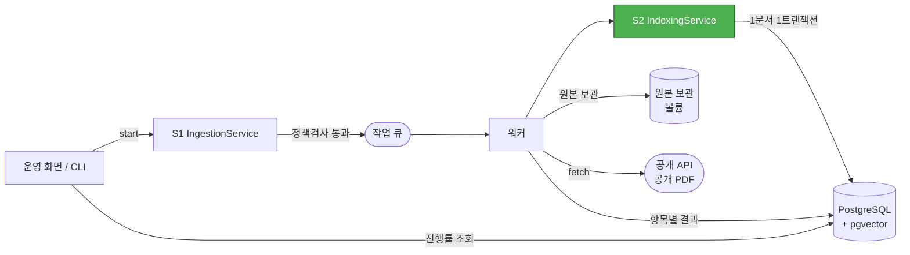

# Business Logic Model — u1-ingestion-index

**단계**: 🟢 CONSTRUCTION / Functional Design
**작성일**: 2026-08-20

> 기술 중립적 워크플로 정의입니다. 참조하는 규칙 번호는 `business-rules.md` 의 BR-nn 입니다.

---

## 1. 워크플로 개요

| # | 워크플로 | 트리거 | 실행 경로 | FR |
|---|---|---|---|---|
| W1 | **수집** | 운영 화면 버튼 / CLI | 비동기 (큐 → 워커) | FR-1~8 |
| W2 | **문서 처리** | W1의 항목별 후속 | 비동기 (워커 내부) | FR-4, 9, 10 |
| W3 | **색인** | W2 완료 직후 | 비동기 (동일 트랜잭션 흐름) | FR-11, 12 |
| W4 | **재색인** | CLI / 운영 화면 | 비동기 | FR-13 |
| W5 | **작업 조회** | 운영 화면 | 동기 | FR-6, 48 |
| W6 | **헬스체크** | 외부 요청 | 동기 | FR-43 |

---

## 2. W1 — 수집 워크플로 (S1 `IngestionService`)

### 2.1 시작 (동기 구간)

```
입력: source_id, since(선택)
 1. 소스 조회               source 미존재 또는 enabled=false -> 즉시 거부 (BR-01)
 2. 인증키 확인             requires_api_key 이고 환경변수 미설정
                             -> 작업 생성하지 않고 명확한 오류 반환 (BR-02, FQ-13=A)
 3. 정책 검사               C14.check(base_url)
                             -> blocked: policy_check 기록 + 작업 생성하지 않음 (BR-03)
                             -> allowed: source.policy_status 갱신 후 계속
 4. 작업 생성               job(kind=ingest, status=pending) (BR-46)
 5. 큐 등록                 즉시 job_id 반환 — 요청 스레드 비점유 (BR-47)
```

### 2.2 워커 실행 (비동기 구간)

```
 6. job.status = running, started_at 기록
 7. 대상 목록 조회          C5.list_targets(since ?? source.last_collected_at)
                             -> job_item 일괄 생성 (status=pending), job.total_count 설정
 8. 항목별 반복 ─────────────────────────────────────────────
      8.1 변경 감지        C15.has_changed(ref, 기존 document)
                             미변경 -> item.status = skipped, 다음 항목 (BR-09~11)
      8.2 원본 수집        C5.fetch(ref)
                             실패 -> 8.5 오류 처리
      8.3 원본 보관        PDF 는 볼륨에, API 응답은 원본 JSON 으로 저장 (BR-12, FQ-8=A)
      8.4 문서 처리 위임   W2 실행 -> 성공 시 item.status = succeeded, document_id 연결
      8.5 오류 처리        C16.classify(error)
                             transient      -> C16.should_retry 판정 후 8.2 재시도 (BR-41)
                             permanent      -> item.status = failed (재시도 없음) (BR-42)
                             policy_blocked -> item.status = failed + policy_check 기록,
                                               재시도 및 폴백 경로 금지 (BR-43)
      8.6 카운터 갱신      job.success_count / skipped_count / failure_count
    ───────────────────────────────────────────────────────
 9. 최종 상태 판정          BR-48
                             성공 >= 1 이고 실패 >= 1 -> partial
                             성공 == 0 이고 실패 >= 1 -> failed
                             실패 == 0               -> succeeded
10. source.last_collected_at 갱신  — succeeded 또는 partial 인 경우만 (BR-13)
11. job.finished_at 기록
```

**⚠️ 8.6 카운터 규칙**: `skipped`(변경 없음)는 실패로 집계하지 않으며,
전건 `skipped` 인 경우 최종 상태는 `succeeded` 입니다 (BR-49).

---

## 3. W2 — 문서 처리 파이프라인 (S2 `IndexingService`, C23 `PipelineRunner`)

### 3.1 단계 체인 (DD-3)

```
 fetch -> extract -> normalize -> structure -> chunk -> embed -> persist
```

각 단계 완료 시 `job_item.last_stage` 를 갱신합니다. 실패 시 **그 단계부터 재개**합니다 (BR-44).

| 단계 | 컴포넌트 | 입력 → 출력 | 실패 시 |
|---|---|---|---|
| `fetch` | C18 | `SourceRef` → 원본 바이트/객체 + 보관 경로 | transient 재시도 |
| `extract` | C19 | 원본 → 텍스트 (PDF 텍스트 추출) | permanent (추출 불가) |
| `normalize` | C20 | 텍스트 → 정규화 텍스트 (BR-14) | permanent |
| `structure` | C21 | 정규화 텍스트 → 섹션 목록 | **실패해도 진행** (BR-24) |
| `chunk` | C22 | 섹션 → 청크 목록 + 메타 | permanent |
| `embed` | C24 | 청크 → 벡터 | transient 재시도 |
| `persist` | C4 | 전체 → DB 반영 | transient 재시도 |

### 3.2 `structure` 단계 — 문서 유형별 분기

```
doc_type == msds:
    MSDS 16섹션 헤더 패턴 탐색                        (BR-15~19)
    인식 섹션 수 >= 8  -> structure_status = structured
    그 미만            -> structure_status = unstructured  (BR-20)
                          document_section 행 생성하지 않음
                          -> chunk 단계에서 문단 단위 폴백 (BR-28)

doc_type == law:
    "제N조" 패턴으로 조 단위 분해                       (BR-21)
    항(①②③ 또는 "제N항")·호는 조 청크 내부 구조로 보존   (BR-22)
    부칙·별표는 별도 섹션으로 분리                       (BR-23)

doc_type == incident:
    구조화 필드(일시·장소·물질·원인·피해·조치)를 섹션으로 매핑 (BR-25)
    필드 부재 시 해당 섹션 생략
```

### 3.3 `chunk` 단계 — 청킹 (FQ-1, FQ-2 = A)

```
structure_status == structured:
    각 섹션 1개 -> 청크 1개                              (BR-26)
    단, token_count > MAX_CHUNK_TOKENS(1000) 인 섹션만
      문단 경계로 분할하며, 분할된 청크는 동일 section_id 를 공유 (BR-27)
      문단 경계가 없으면 경계 사다리를 내려간다              (BR-27a)
        빈 줄 -> 단일 줄바꿈 -> 문장 경계 -> (최후) 토큰 절단
        윗 단계로 상한을 못 지킬 때만 다음 단계로 내려가며,
        조각은 상한까지 다시 묶는다. 상한은 불변식이다.

structure_status == unstructured:
    문단(빈 줄) 경계로 누적하다가 MAX_CHUNK_TOKENS 초과 직전에 분할 (BR-28)
    section_id = NULL

공통:
    중첩(overlap) 없음                                    (BR-29)
    start_offset / end_offset 은 extracted_text.text 기준  (BR-30)
    token_count < MIN_CHUNK_TOKENS(20) 인 청크는 앞 청크에 병합 (BR-31)
    chunk.meta 를 BR-35 규칙으로 구성
```

---

## 4. W3 — 색인 워크플로

```
1. 임베딩 생성      C24.embed_chunks(chunks)
                     배치 크기 EMBED_BATCH_SIZE(기본 32) (BR-61, FQ-15=A)
                     동일 텍스트 해시는 캐시 재사용        (BR-62)
2. 트랜잭션 시작  ── 문서 1건 = 1 트랜잭션 (DD-24, BR-53)
     2.1 기존 파생 데이터 삭제 (재처리인 경우) — chunk, chunk_embedding (BR-54)
     2.2 document / extracted_text / document_section 저장
     2.3 chunk 저장 (search_vector 생성 포함)  <- 키워드 인덱스 (FR-12)
     2.4 chunk_embedding 저장                  <- 벡터 인덱스 (FR-11)
     2.5 document_substance 연결 (BR-37)
   트랜잭션 종료 ──
3. job_item.last_stage = persist, status = succeeded
```

**⚠️ 2.3 과 2.4 가 같은 트랜잭션에 포함됩니다** (DD-23).
키워드 인덱스와 벡터 인덱스의 불일치가 구조적으로 발생하지 않습니다.

---

## 5. W4 — 재색인 워크플로 (FR-13)

### 5.1 문서 단위 재색인

```
입력: document_id
1. 원본 보관 확인    original_path 존재 -> 재수집 없이 재파싱 (FQ-8=A 의 이득)
                     원본 미보관        -> source_url 로 재수집
2. W2 파이프라인을 extract 단계부터 실행
3. W3 색인 (기존 파생 데이터 삭제 후 재삽입 — BR-54)
```

### 5.2 전체 재색인 (임베딩 모델 교체 시)

```
입력: 새 model_id
1. C27.needs_reindex(new_model_id) 판정
     기존 chunk_embedding.model_id 와 동일 -> 재색인 불필요
2. job(kind=reindex) 생성, 전 문서를 job_item 으로 등록
3. 문서별로:
     chunk 는 그대로 두고 chunk_embedding 만 새 model_id 로 추가 생성 (BR-55)
4. 전건 완료 후 설정의 활성 model_id 를 전환
```

**설계 요점**: 벡터를 `chunk_embedding` 으로 분리했기 때문에(E8) **새 모델 벡터를 병행 적재한 뒤
전환**할 수 있습니다. 재색인 중에도 기존 모델로 검색이 계속 동작합니다.

---

## 6. W5 — 작업 조회 (FR-6, FR-48)

```
소스 목록:    source 전건 + 마지막 수집 시각 + 정책 상태
작업 목록:    job 최신순 + status + 진행률(= (success+skipped+failure) / total)
작업 상세:    job + job_item 목록 (status 별 필터)
              실패 항목은 failure_kind, failure_reason, attempt_count, last_stage 표시
```

**진행률 계산** (BR-50):
```
total_count == 0        -> 0%
그 외                    -> (success_count + skipped_count + failure_count) / total_count
```

---

## 7. W6 — 헬스체크 (FR-43)

```
app    : 프로세스 응답 여부
db     : 단순 질의 성공 여부 + pgvector 확장 등록 확인
queue  : 큐 백엔드 연결 확인
worker : 최근 하트비트 시각이 임계값 이내인지 (BR-52)

전부 정상 -> 200 / 하나라도 비정상 -> 503 + 항목별 상태
```

---

## 8. 상태 전이 모델

### 8.1 `job` 상태 전이



**Text Alternative**
```
pending -> running -> { succeeded | partial | failed } -> 종료
재실행은 새로운 job 을 생성하며, 기존 job 의 상태는 변경하지 않는다 (BR-51).
```

### 8.2 `job_item` 상태 전이



**Text Alternative**
```
pending -> running -> { skipped | succeeded | failed }
running -> running : transient 오류 시 최대 3회 재시도 (1s / 4s / 16s)
failed  -> running : 같은 소스로 재실행하면 last_stage 부터 재개 (BR-44)
```

---

## 9. 부분 실패 및 재개 흐름 (FR-8)

```
1. 항목 A 실패 (permanent)  -> A.status = failed, 다음 항목 계속 (BR-40)
2. 작업 종료               -> job.status = partial
3. 사용자가 같은 소스로 재실행
4. 새 job 생성 후 대상 목록 조회
5. 이전 job 의 failed 항목 중 last_stage 가 있는 것은
   해당 단계부터 재개 (fetch 부터 다시 하지 않음) (BR-44, BR-45)
6. permanent 실패였던 항목도 재시도한다 — 소스 측이 수정되었을 수 있음 (BR-45)
   단 policy_blocked 항목은 정책 재검사가 allowed 로 바뀌기 전까지 건너뛴다 (BR-43)
```

---

## 10. 데이터 흐름 요약



**Text Alternative**
```
운영화면/CLI -> S1 수집서비스 -> (정책검사 통과 시) 작업큐 -> 워커
워커 -> 외부 공개 API/PDF 에서 원본 확보 -> 원본 보관 볼륨에 저장
워커 -> S2 색인서비스 -> PostgreSQL(+pgvector) 에 문서 1건 = 1 트랜잭션으로 반영
워커 -> job_item 별 결과를 DB 에 기록
운영화면 -> DB 에서 진행률·항목별 실패 사유 조회
```

---

## 11. FR 커버리지

| FR | 워크플로 | 규칙 |
|---|---|---|
| FR-1~4 수집 4종 | W1 §2.2 8.2 | BR-04~08 |
| FR-5 정책 준수 | W1 §2.1 3 | BR-03, BR-43 |
| FR-6 큐·진행률 | W1 §2.1 5, W5 | BR-46, BR-47, BR-50 |
| FR-7 증분 갱신 | W1 §2.2 8.1 | BR-09~13 |
| FR-8 재시도·부분실패 | W1 §2.2 8.5, §9 | BR-40~45, BR-48 |
| FR-9 정규화·구조분해 | W2 §3.2 | BR-14~25 |
| FR-10 청킹·메타 | W2 §3.3 | BR-26~37 |
| FR-11 임베딩·벡터적재 | W3 | BR-61, BR-62 |
| FR-12 키워드 인덱스 | W3 §2.3 | BR-38 |
| FR-13 재색인 | W4 | BR-54, BR-55 |
| FR-40 구조적 로깅 | 전 워크플로 | BR-57~60 |
| FR-43 헬스체크 | W6 | BR-52 |
| FR-48 운영 화면 | W5 | BR-50, `frontend-components.md` |

**u1 FR 16건 전건 커버** ✅
