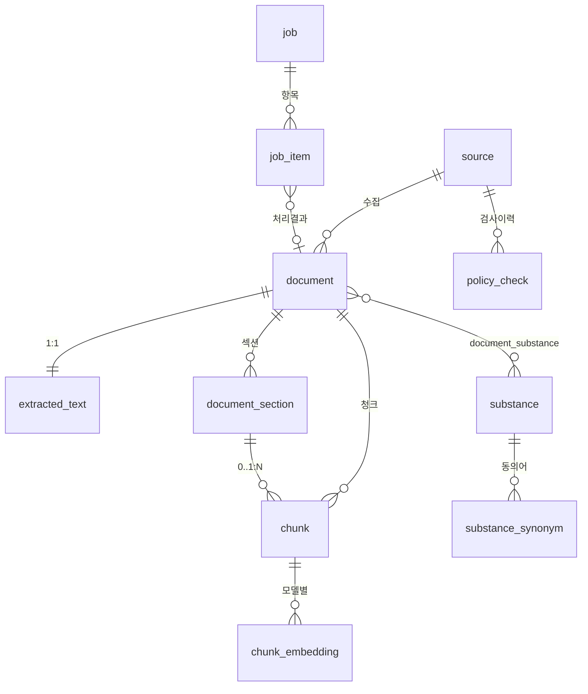

# Domain Entities — u1-ingestion-index

**단계**: 🟢 CONSTRUCTION / Functional Design
**작성일**: 2026-08-20
**근거**: `construction/plans/u1-ingestion-index-functional-design-plan.md` (FQ-1~FQ-18 확정)

> **이월 항목 1번 "DB 스키마 상세" 를 본 문서에서 확정합니다.**
> 기술 중립적으로 기술하며, 물리 타입·마이그레이션은 Infrastructure Design 및 Code Generation에서 확정합니다.

---

## 1. 엔터티 목록

| # | 엔터티 | 목적 | 도입 유닛 |
|---|---|---|---|
| E1 | `source` | 수집 소스 정의와 정책·수집 상태 | u1 |
| E2 | `substance` | 화학물질 마스터 | u1 |
| E3 | `substance_synonym` | 물질 동의어 (국문·영문·이명·CAS·UN) | **u1 선반영 → u3 사용** |
| E4 | `document` | 수집된 문서 | u1 |
| E5 | `extracted_text` | 정규화된 추출 텍스트 (오프셋 기준) | u1 |
| E6 | `document_section` | 문서 내 섹션 (MSDS 16섹션 / 법령 조) | u1 |
| E7 | `chunk` | 검색 단위 청크 | u1 |
| E8 | `chunk_embedding` | 청크의 임베딩 벡터 (모델별) | u1 |
| E9 | `document_substance` | 문서↔물질 다대다 | u1 |
| E10 | `job` | 비동기 작업 | u1 |
| E11 | `job_item` | 작업 항목 (문서 1건 단위) | u1 |
| E12 | `policy_check` | 접근 정책 검사 이력 | u1 |
| E13 | `worker_heartbeat` | 워커 생존 판정 (BR-52) | u1 |

> **E13 추가 (2026-08-20, Code Generation)**: BR-52 의 워커 헬스 판정에 마지막 하트비트
> 시각이 필요한데 최초 엔터티 목록에 없었다. Build & Test 에서 이 컬럼 덕분에
> 워커 크래시 루프가 `/healthz` 에 `worker: down` 으로 즉시 드러났다.
> 속성: `worker_id`(PK, str64), `beat_at`(datetime, NOT NULL).

---

## 2. Enum 정의

| Enum | 값 | 비고 |
|---|---|---|
| **SourceKind** | `api` \| `pdf` \| `dataset` | 소스 유형 |
| **DocType** | `msds` \| `law` \| `incident` \| `user_upload` | `user_upload` 는 u5에서 사용 (선반영) |
| **StructureStatus** | `structured` \| `unstructured` | `unstructured` = 섹션 인식 실패 (FQ-3=A) |
| **JobKind** | `ingest` \| `index` \| `reindex` \| `upload_index` | `upload_index` 는 u5 선반영 |
| **JobStatus** | `pending` \| `running` \| `succeeded` \| `partial` \| `failed` | FQ-12=A |
| **ItemStatus** | `pending` \| `running` \| `succeeded` \| `skipped` \| `failed` | `skipped` = 변경 없음 |
| **FailureKind** | `transient` \| `permanent` \| `policy_blocked` | FQ-11=A |
| **PolicyDecision** | `allowed` \| `blocked` \| `unknown` | |
| **SynonymType** | `ko` \| `en` \| `alias` \| `cas` \| `un` | |
| **PipelineStage** | `fetch` \| `extract` \| `normalize` \| `structure` \| `chunk` \| `embed` \| `persist` | 재개 지점 (DD-3) |
| **SubstanceRelation** | `subject` \| `mentioned` \| `regulated` | 문서↔물질 관계 성격 |

---

## 3. 엔터티 상세

### E1 `source` — 수집 소스

| 속성 | 타입 | 제약 | 설명 |
|---|---|---|---|
| `id` | int | PK | |
| `source_id` | str(64) | **UNIQUE**, NOT NULL | 논리 식별자 (`ncis_substance`, `law_api`, `incident_data`, `msds_pdf`) |
| `name` | str(200) | NOT NULL | 표시명 |
| `kind` | SourceKind | NOT NULL | |
| `base_url` | str(500) | NOT NULL | |
| `doc_type` | DocType | NOT NULL | 이 소스가 생산하는 문서 유형 |
| `requires_api_key` | bool | NOT NULL, 기본 false | FQ-13=A — 키 미설정 시 수집 시도에서만 실패 |
| `api_key_env` | str(64) | NULL | 인증키를 읽을 환경변수 이름 (**값은 저장하지 않음**, NFR-14) |
| `policy_status` | PolicyDecision | NOT NULL, 기본 `unknown` | |
| `policy_reason` | text | NULL | |
| `policy_checked_at` | datetime | NULL | |
| `last_collected_at` | datetime | NULL | 증분 수집 기준 시각 |
| `enabled` | bool | NOT NULL, 기본 true | |

**인덱스**: `UNIQUE(source_id)`

---

### E2 `substance` — 화학물질 마스터

| 속성 | 타입 | 제약 | 설명 |
|---|---|---|---|
| `id` | int | PK | |
| `cas_number` | str(20) | UNIQUE, NULL | CAS 등록번호. 없는 물질도 존재 |
| `un_number` | str(10) | NULL | UN 번호 |
| `name_ko` | str(300) | NULL | 국문명 |
| `name_en` | str(300) | NULL | 영문명 |
| `ghs_classification` | json | NULL | 유해·위험성 구분 목록 |
| `signal_word` | str(20) | NULL | 위험 / 경고 |
| `h_codes` | json(str[]) | NULL | 유해위험문구 코드 |
| `p_codes` | json(str[]) | NULL | 예방조치문구 코드 |
| `physical_properties` | json | NULL | 끓는점·인화점·증기압 등 |
| `is_regulated` | bool | NOT NULL, 기본 false | 법령 규제 대상 여부 (FQ-14 선정 기준) |
| `created_at` / `updated_at` | datetime | NOT NULL | |

**제약**: `name_ko`, `name_en`, `cas_number` 중 **최소 1개는 NOT NULL** (BR-33)
**인덱스**: `UNIQUE(cas_number)`, `INDEX(is_regulated)`

> **u3 관련 고지**: `ghs_classification`, `h_codes`, `p_codes`, `physical_properties` 는
> u1에서 **적재만** 하고, 물질 안전 카드로 조립하는 로직은 u3에서 구현합니다 (DD-10).

---

### E3 `substance_synonym` — 동의어 **(u1 선반영, u3 사용)**

| 속성 | 타입 | 제약 | 설명 |
|---|---|---|---|
| `id` | int | PK | |
| `substance_id` | int | FK → E2, NOT NULL, ON DELETE CASCADE | |
| `term` | str(300) | NOT NULL | 원문 표기 |
| `normalized_term` | str(300) | NOT NULL | 정규화 표기 (BR-34) |
| `term_type` | SynonymType | NOT NULL | |

**인덱스**: `UNIQUE(substance_id, normalized_term, term_type)`, **`INDEX(normalized_term)`**

> **선반영 근거 (DD-21, UD-6)**: 수집 시점에 이명 데이터를 함께 적재해야 u3에서 재수집이 발생하지 않습니다.

---

### E4 `document` — 문서

| 속성 | 타입 | 제약 | 설명 |
|---|---|---|---|
| `id` | int | PK | |
| `source_id` | int | FK → E1, NULL | `user_upload` 는 소스 없음 (u5) |
| `external_id` | str(200) | NULL | 소스 내 문서 식별자 |
| `doc_type` | DocType | **NOT NULL** | **필수** (BR-32) |
| `title` | str(500) | NULL | |
| `source_url` | str(1000) | **NOT NULL** | **필수 — 없으면 색인 거부** (BR-32, FQ-7=A) |
| `published_at` | datetime | NULL | |
| `revised_at` | datetime | NULL | |
| `content_hash` | str(64) | NULL | 증분 감지용 (BR-09) |
| `original_path` | str(500) | NULL | 보관된 원본 경로 (FQ-8=A) |
| `original_media_type` | str(100) | NULL | `application/pdf`, `application/json` 등 |
| `structure_status` | StructureStatus | NOT NULL, 기본 `structured` | FQ-3=A |
| `owner_id` | int | **NULL** | **u5 선반영.** NULL = 공개 코퍼스 |
| `law_name` | str(200) | NULL | `law` 유형 전용 — 법령명 |
| `incident_occurred_at` | datetime | NULL | `incident` 유형 전용 |
| `created_at` / `updated_at` | datetime | NOT NULL | |

**인덱스**: `UNIQUE(source_id, external_id)` (둘 다 NOT NULL 인 경우), `INDEX(content_hash)`,
`INDEX(doc_type)`, **`INDEX(owner_id)`**

> **선반영 근거**: `owner_id` 를 u5에서 추가하면 이미 적재된 문서·청크 전체에
> `ALTER TABLE` 이 발생합니다 (DD-21).

---

### E5 `extracted_text` — 추출 텍스트

| 속성 | 타입 | 제약 | 설명 |
|---|---|---|---|
| `id` | int | PK | |
| `document_id` | int | FK → E4, **UNIQUE**, NOT NULL, ON DELETE CASCADE | 1:1 |
| `text` | text | NOT NULL | **정규화 완료된 텍스트** |
| `char_count` | int | NOT NULL | |
| `extractor` | str(64) | NOT NULL | 사용된 추출기 식별 |
| `extracted_at` | datetime | NOT NULL | |

> **FQ-5=A 결정**: 모든 오프셋(`document_section`, `chunk`)은 **이 `text` 를 기준**으로 합니다.
> PDF 원본 좌표 역추적은 하지 않으며, 원본은 `document.original_path` 링크로만 제공합니다.

---

### E6 `document_section` — 섹션

| 속성 | 타입 | 제약 | 설명 |
|---|---|---|---|
| `id` | int | PK | |
| `document_id` | int | FK → E4, NOT NULL, ON DELETE CASCADE | |
| `ordinal` | int | NOT NULL | 문서 내 순서 (0부터) |
| `section_code` | str(50) | NULL | `msds_01`~`msds_16`, `제12조` 등 |
| `section_title` | str(300) | NULL | |
| `start_offset` | int | NOT NULL | `extracted_text.text` 기준 |
| `end_offset` | int | NOT NULL | |

**제약**: `start_offset < end_offset`
**인덱스**: `UNIQUE(document_id, ordinal)`, `INDEX(document_id, section_code)`

> `structure_status = unstructured` 인 문서는 이 테이블에 **행을 생성하지 않습니다** (BR-24).

---

### E7 `chunk` — 청크 (검색 단위)

| 속성 | 타입 | 제약 | 설명 |
|---|---|---|---|
| `id` | int | PK | |
| `document_id` | int | FK → E4, NOT NULL, ON DELETE CASCADE | |
| `section_id` | int | FK → E6, **NULL** | 구조 미상 문서는 NULL (FQ-3=A) |
| `ordinal` | int | NOT NULL | 문서 내 청크 순서 |
| `text` | text | NOT NULL | |
| `token_count` | int | NOT NULL | |
| `start_offset` | int | NOT NULL | `extracted_text.text` 기준 |
| `end_offset` | int | NOT NULL | |
| `owner_id` | int | **NULL** | **u5 선반영.** NULL = 공개 |
| `meta` | json | NOT NULL | 아래 §3.1 참조 |
| `search_vector` | tsvector | NOT NULL (생성 컬럼) | 키워드 검색용 (FR-12) |
| `created_at` | datetime | NOT NULL | |

**인덱스**:
- `INDEX(document_id, ordinal)`
- **`INDEX(owner_id)`** — u5 스코프 필터
- **GIN(`search_vector`)** — 전문검색
- **`INDEX((meta->>'cas_number'))`** — CAS 정확 매칭 (FR-12)
- **`INDEX((meta->>'doc_type'))`** — 문서유형 필터

#### 3.1 `chunk.meta` 스키마

```json
{
  "doc_type": "msds",
  "source_url": "https://...",
  "published_at": "2024-03-01",
  "section_code": "msds_08",
  "section_title": "노출방지 및 개인보호구",
  "substance_ids": [12, 45],
  "cas_number": "7664-93-9",
  "un_number": "1830",
  "substance_names": ["황산", "Sulfuric acid"],
  "law_name": null,
  "structure_status": "structured"
}
```

**메타 부착 근거**: 검색 시 조인 없이 필터링·표시가 가능해야 합니다 (NFR-2 검색 P95 2.5초).
정합성의 단일 출처는 관계형 테이블이며, `meta` 는 **역정규화 사본**입니다 (BR-36).

---

### E8 `chunk_embedding` — 임베딩 벡터

| 속성 | 타입 | 제약 | 설명 |
|---|---|---|---|
| `id` | int | PK | |
| `chunk_id` | int | FK → E7, NOT NULL, ON DELETE CASCADE | |
| `model_id` | str(128) | NOT NULL | 임베딩 모델 식별자 (`EmbeddingPort.model_id()`) |
| `dim` | int | NOT NULL | |
| `embedding` | vector(dim) | NOT NULL | |
| `created_at` | datetime | NOT NULL | |

**인덱스**: `UNIQUE(chunk_id, model_id)`, **벡터 근사 최근접 인덱스** (`model_id` 별)

> **별도 테이블로 분리한 근거**: 임베딩 모델 교체 시(NFR-21) 새 모델 벡터를 병행 적재한 뒤
> 전환할 수 있습니다. `chunk` 에 벡터 컬럼을 두면 교체 중 서비스 중단이 발생합니다.

---

### E9 `document_substance` — 문서 ↔ 물질 (다대다, FQ-6=A)

| 속성 | 타입 | 제약 | 설명 |
|---|---|---|---|
| `document_id` | int | FK → E4, PK 구성 | |
| `substance_id` | int | FK → E2, PK 구성 | |
| `relation` | SubstanceRelation | NOT NULL | `subject`(MSDS 대상) / `mentioned`(사고사례 언급) / `regulated`(법령 규제 대상) |

**인덱스**: `PK(document_id, substance_id)`, `INDEX(substance_id)`

| 문서 유형 | 통상 연결 수 | 관계 |
|---|---|---|
| `msds` | 1건 | `subject` |
| `incident` | 0~N건 | `mentioned` |
| `law` | 0~N건 | `regulated` (별표 물질 목록이 있는 경우) |

---

### E10 `job` — 비동기 작업

| 속성 | 타입 | 제약 | 설명 |
|---|---|---|---|
| `id` | int | PK | |
| `kind` | JobKind | NOT NULL | |
| `params` | json | NOT NULL | `{source_id, since, document_id, ...}` |
| `status` | JobStatus | NOT NULL, 기본 `pending` | |
| `total_count` | int | NOT NULL, 기본 0 | |
| `success_count` | int | NOT NULL, 기본 0 | |
| `skipped_count` | int | NOT NULL, 기본 0 | |
| `failure_count` | int | NOT NULL, 기본 0 | |
| `started_at` / `finished_at` | datetime | NULL | |
| `created_at` | datetime | NOT NULL | |

**인덱스**: `INDEX(status, created_at DESC)`, `INDEX(kind)`

---

### E11 `job_item` — 작업 항목

| 속성 | 타입 | 제약 | 설명 |
|---|---|---|---|
| `id` | int | PK | |
| `job_id` | int | FK → E10, NOT NULL, ON DELETE CASCADE | |
| `ref_key` | str(500) | NOT NULL | 대상 식별자 (외부 ID 또는 URL) |
| `document_id` | int | FK → E4, NULL | 처리 성공 시 연결 |
| `status` | ItemStatus | NOT NULL, 기본 `pending` | |
| `last_stage` | PipelineStage | NULL | **재개 지점** (DD-3) |
| `failure_kind` | FailureKind | NULL | |
| `failure_reason` | text | NULL | **비밀값 마스킹 후 저장** (BR-60) |
| `attempt_count` | int | NOT NULL, 기본 0 | |
| `updated_at` | datetime | NOT NULL | |

**인덱스**: `UNIQUE(job_id, ref_key)`, `INDEX(job_id, status)`

---

### E12 `policy_check` — 접근 정책 검사 이력 (FR-5)

| 속성 | 타입 | 제약 | 설명 |
|---|---|---|---|
| `id` | int | PK | |
| `source_id` | int | FK → E1, NULL | |
| `url` | str(1000) | NOT NULL | |
| `decision` | PolicyDecision | NOT NULL | |
| `reason` | text | NULL | robots 규칙 원문 또는 약관 근거 |
| `checked_at` | datetime | NOT NULL | |

**인덱스**: `INDEX(source_id, checked_at DESC)`

> **감사 목적**: 차단된 소스를 **수집하지 않았다는 사실 자체**가 기록으로 남아야 합니다 (CON-3).

---

## 4. 엔터티 관계도



### Text Alternative

```
source  1 --- N  document          (수집 출처)
source  1 --- N  policy_check      (정책 검사 이력)

document 1 --- 1  extracted_text   (추출 텍스트, 오프셋 기준)
document 1 --- N  document_section (섹션. 구조 미상 문서는 0건)
document 1 --- N  chunk
document_section 0..1 --- N chunk  (구조 미상 청크는 section_id = NULL)

chunk    1 --- N  chunk_embedding  (임베딩 모델별 1건)

document N --- N  substance        (document_substance 경유, relation 속성 보유)
substance 1 --- N substance_synonym

job      1 --- N  job_item
job_item 0..1 --- 1 document       (성공 시 연결)
```

---

## 5. 삭제 정책 (Cascade)

| 삭제 대상 | 연쇄 삭제 | 근거 |
|---|---|---|
| `document` | `extracted_text`, `document_section`, `chunk`, `chunk_embedding`, `document_substance` | 문서 삭제 시 파생 데이터 전부 제거 (FR-29 대비 선반영) |
| `substance` | `substance_synonym` | |
| `job` | `job_item` | |
| `source` | **연쇄 삭제하지 않음** — `document.source_id` 를 NULL 로 설정 | 이미 수집한 문서는 소스 정의가 사라져도 보존 |

**추가 규칙**: `document` 삭제 시 `document.original_path` 가 가리키는 **원본 파일도 같은
트랜잭션 내에서 제거**합니다 (BR-56).

---

## 6. u2~u5 를 위한 선반영 요소 확인

| 선반영 | 위치 | 사용 유닛 | 상태 |
|---|---|---|---|
| `chunk.owner_id` (nullable, 기본 NULL) | E7 | u5 | ✅ 반영 |
| `document.owner_id` (nullable) | E4 | u5 | ✅ 반영 |
| `DocType.user_upload` enum 값 | Enum | u5 | ✅ 반영 |
| `JobKind.upload_index` enum 값 | Enum | u5 | ✅ 반영 |
| `substance_synonym` 테이블 | E3 | u3 | ✅ 반영 |
| `substance` 의 GHS·H/P·물성 컬럼 | E2 | u3 | ✅ 반영 |
| `chunk_embedding` 의 `model_id` 분리 | E8 | u2 재색인 | ✅ 반영 |

**u1 시점에는 `owner_id` 가 항상 NULL 이고 `user_upload` 문서가 생성되지 않습니다.**
의도된 미사용 상태이며, u5 착수 시 스키마 변경 없이 활성화됩니다.

---

## 7. 인덱스 요약 (NFR-9: 청크 10만 건 규모)

| 인덱스 | 대상 | 목적 | FR/NFR |
|---|---|---|---|
| GIN(`chunk.search_vector`) | 전문검색 | 키워드 후보 검색 | FR-12, NFR-2 |
| `chunk.meta->>'cas_number'` | 표현식 인덱스 | **CAS 정확 매칭** | FR-12 |
| 벡터 근사 최근접 (`chunk_embedding`) | `model_id` 별 | 벡터 후보 검색 | FR-11, NFR-2 |
| `substance_synonym.normalized_term` | B-tree | 동의어 조회 | FR-26 (u3) |
| `chunk.owner_id` | B-tree | 소유자 스코프 필터 | FR-28 (u5) |
| `document.content_hash` | B-tree | 증분 감지 | FR-7 |
| `job_item(job_id, status)` | 복합 | 진행률 집계·재개 항목 조회 | FR-6, FR-8 |
| `job(status, created_at DESC)` | 복합 | 작업 목록 화면 | FR-48 |
