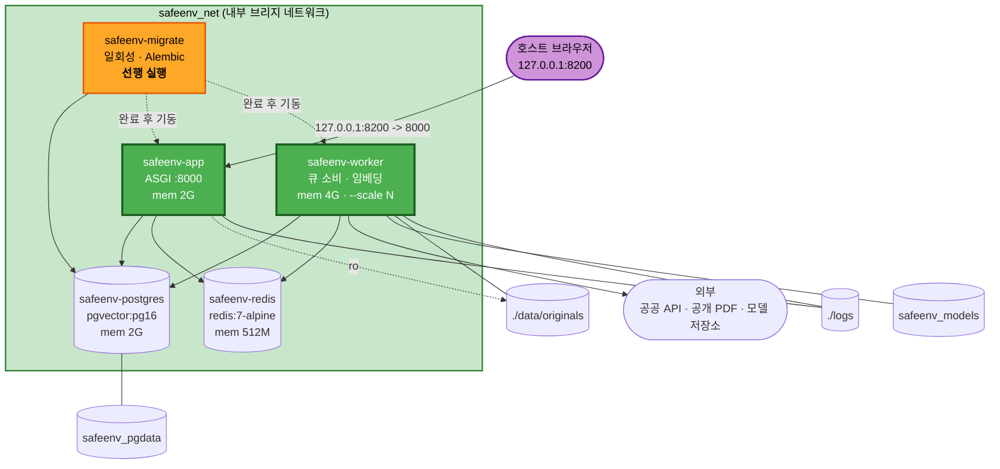

# Deployment Architecture — u1-ingestion-index

**단계**: 🟢 CONSTRUCTION / Infrastructure Design
**작성일**: 2026-08-20

---

## 1. 배포 토폴로지



### Text Alternative

```
호스트 브라우저 --(127.0.0.1:8200 -> 컨테이너 8000)--> safeenv-app

safeenv_net (내부 브리지 네트워크)
  safeenv-migrate   일회성. Alembic upgrade head. postgres healthy 후 실행.
                    종료코드 0 이면 app / worker 기동 허용.
  safeenv-app       ASGI :8000. 웹 라우터 + 헬스체크 + CLI exec 지점. mem 2G.
  safeenv-worker    큐 소비. 수집 파이프라인 + 임베딩. mem 4G. --scale 로 확장.
  safeenv-postgres  pgvector/pgvector:pg16. 호스트 노출 없음. mem 2G.
  safeenv-redis     redis:7-alpine. 호스트 노출 없음. 영속성 비활성. mem 512M.

볼륨
  safeenv_pgdata     -> postgres 데이터
  safeenv_models     -> worker 임베딩 모델 캐시
  ./data/originals   -> worker(rw) / app(ro) 원본 보관
  ./logs             -> app, worker 로그 파일

외부 통신
  worker -> 공공 API / 공개 PDF / 모델 저장소   (아웃바운드만)
  app, postgres, redis 는 외부 인바운드 없음
```

---

## 2. 기동 순서

```
1. postgres 기동          -> healthcheck: pg_isready 통과 대기
2. redis 기동             -> healthcheck: PING 통과 대기
3. migrate 실행           -> Alembic upgrade head
                             성공(exit 0) 시에만 다음 단계 진행
4. app 기동               -> /healthz 응답 시작
5. worker 기동            -> 큐 구독 시작, 하트비트 갱신 시작
```

**의존 선언**:
- `migrate` → `postgres` (`service_healthy`)
- `app`, `worker` → `migrate` (`service_completed_successfully`), `postgres`(healthy), `redis`(healthy)

**설계 근거 (ID-10)**: `app` 과 `worker` 가 각자 마이그레이션을 실행하면 경합이 발생합니다.
일회성 서비스를 선행시켜 경합을 구조적으로 제거합니다.

---

## 3. 운영 명령

| 목적 | 명령 |
|---|---|
| 전체 기동 | `docker compose up -d` |
| 워커 확장 | `docker compose up -d --scale worker=3` |
| 로그 확인 | `docker compose logs -f app worker` |
| 수집 실행 (CLI) | `docker compose exec app python -m app.cli ingest --source {source_id}` |
| 재색인 | `docker compose exec app python -m app.cli reindex --scope all` |
| 백업 | `./scripts/backup.sh` |
| 복원 | `./scripts/restore.sh ./backups/safeenv-{timestamp}.dump` |
| 정지 (데이터 보존) | `docker compose down` |
| 완전 삭제 | `docker compose down -v` ⚠️ **볼륨까지 삭제** |

> **⚠️ `down -v` 주의**: 초기 색인에 최대 8시간이 소요되므로(NFR-4),
> 실행 전 `backup.sh` 를 먼저 수행하십시오 (ID-9).

---

## 4. 네트워크 및 노출 정책

| 컨테이너 | 호스트 노출 | 내부 통신 | 외부 아웃바운드 |
|---|---|---|---|
| `app` | **`127.0.0.1:8200`** | postgres, redis | 없음 (u2에서 LLM API 추가) |
| `worker` | 없음 | postgres, redis | **있음** — 공공 API, PDF, 모델 저장소 |
| `postgres` | **없음** | — | 없음 |
| `redis` | **없음** | — | 없음 |
| `migrate` | 없음 | postgres | 없음 |

### NFR-18 구현 지점

```
컨테이너 내부:  APP_HOST=0.0.0.0   (컨테이너 네트워크에서 접근 가능해야 하므로)
호스트 노출:    "127.0.0.1:8200:8000"   <- 이 접두사가 NFR-18 을 달성
```

**`127.0.0.1:` 접두사를 제거하면 즉시 NFR-18 위반**이 됩니다.
`docker-compose.yml` 에 제거 금지 주석을 명시합니다.

### 개발 편의를 위한 DB 접속

DB 툴 접속이 필요하면 `docker-compose.override.yml`(gitignore 대상)에서
개발 시에만 포트를 개방합니다. 기본 `docker-compose.yml` 은 변경하지 않습니다.

---

## 5. 데이터 흐름 (인프라 관점)

```
[외부 공개 API/PDF]
        |  아웃바운드 HTTPS (worker 만)
        v
[safeenv-worker] --원본 저장--> [./data/originals]
        |
        |  임베딩 (모델은 safeenv_models 에서 로드)
        v
[safeenv-postgres] <-- 청크 + 벡터 + 키워드 인덱스 (동일 트랜잭션, DD-23)
        ^
        |  조회
[safeenv-app] <-- HTTP --- [호스트 브라우저 127.0.0.1:8200]

[safeenv-redis] : app -> 작업 등록 / worker -> 작업 소비 (상태 미보유)
```

---

## 6. 장애 시나리오와 동작

| 시나리오 | 동작 | 복구 |
|---|---|---|
| `worker` 중단 | `restart: unless-stopped` 로 자동 재시작. 미완료 작업은 `job_item.status = pending` 유지 | 재시작 후 `last_stage` 부터 재개 (BR-44) |
| `redis` 재시작 | 큐 메시지 손실. **작업 상태는 PostgreSQL 에 보존** (DD-13) | 사용자가 작업 재실행 → 미완료 항목만 처리 |
| `postgres` 중단 | `app`·`worker` 헬스체크 실패, `/healthz` 503 | 재시작 시 볼륨에서 데이터 복원 |
| `migrate` 실패 | `app`·`worker` 가 기동하지 않음 | 마이그레이션 오류 수정 후 재기동 |
| 모델 다운로드 실패 | `worker` 의 임베딩 단계에서 `transient` 실패 | 재시도(BR-41). 네트워크 복구 후 재실행 |
| 공공 API 키 미설정 | 해당 소스 수집만 실패, 다른 소스는 정상 | 환경변수 설정 후 재실행 (BR-02) |
| 정책 차단 소스 | 작업 자체가 생성되지 않음 | 우회하지 않음. 소스 제외 (BR-03, BR-04) |

> **Resiliency Baseline 확장은 비활성**입니다 (Q28=B). 위 표는 설계상 자연히 도출되는
> 동작을 정리한 것이며, 가용성 목표(RTO/RPO)를 약속하지 않습니다.

---

## 7. 리소스 계획

| 컨테이너 | 메모리 제한 | 근거 |
|---|---|---|
| `worker` | **4G** | 임베딩 모델 상주 + 배치 32 처리. 위험 R-3 대응 |
| `app` | 2G | 웹 요청 처리. **u2 리랭커 도입 시 재검토 필요** |
| `postgres` | 2G | 청크 10만 건 색인·조회 (NFR-9) |
| `redis` | 512M | 큐 메시지만 보유, 영속성 비활성 |
| **합계** | **8.5G** | 호스트에 최소 12G 권장 |

**⚠️ 호스트 요구사항**: Docker Desktop 에 할당된 메모리가 8.5G 미만이면 기동에 실패하거나
OOM 이 발생합니다. README 에 최소 요구사항으로 명시합니다.

---

## 8. 디스크 사용량 예상

| 항목 | 예상 |
|---|---|
| 이미지 (`safeenv-app` + postgres + redis) | ~1.6GB |
| `safeenv_models` (임베딩·리랭커 모델) | ~2GB |
| `./data/originals` (물질 1,000종 원본) | 2~5GB |
| `safeenv_pgdata` (청크 10만 + 벡터) | 3~6GB |
| **합계** | **약 9~15GB** |

**Build & Test 에서 실측값을 기록**하고 예상 대비 차이를 검토합니다.

---

## 9. u2~u5 배포 영향

| 유닛 | 컨테이너 | 볼륨 | 포트 | 환경변수 |
|---|---|---|---|---|
| u2 | 변경 없음 | `safeenv_models` 에 리랭커 추가 | 변경 없음 | `ANTHROPIC_API_KEY` 등 LLM 설정 추가 |
| u4 | 변경 없음 | 변경 없음 | 변경 없음 | 평가 기준선 임계값 추가 |
| u3 | 변경 없음 | 변경 없음 | 변경 없음 | 변경 없음 |
| u5 | 변경 없음 | `./data/originals/uploads/` 하위 분리 | 변경 없음 | JWT 서명키, 업로드 제한값 추가 |

**⚠️ u2 재검토 항목**: 리랭커(cross-encoder)를 `app` 프로세스에서 로드하면 메모리 2G 가
부족할 수 있습니다. u2 Build & Test 에서 실측하고, 필요 시 리랭킹을 워커로 위임하거나
`app` 제한을 상향합니다.

---

## 10. 배포 검증 절차 (Build & Test 용)

| # | 검증 항목 | 기대 결과 | NFR |
|---|---|---|---|
| D-1 | `docker compose up -d` 단일 명령 기동 | 5개 컨테이너 전부 healthy | NFR-29 |
| D-2 | 기동 순서 | `migrate` 완료 후 `app`·`worker` 기동 | ID-10 |
| D-3 | `127.0.0.1:8200` 접속 | 운영 화면 200 응답 | CON-2 |
| D-4 | **외부 인터페이스에서 8200 접속** | **연결 실패** | **NFR-18** |
| D-5 | `postgres`·`redis` 호스트 포트 | **노출 없음 확인** | NFR-18 |
| D-6 | 컨테이너 사용자 | `id` → uid=10001 | NFR-30 |
| D-7 | `down` 후 `up` | 데이터 보존 | NFR-31 |
| D-8 | 바인드 마운트 쓰기 | `worker` 가 `./data/originals` 에 파일 생성 | ID-8 |
| D-9 | 모델 캐시 | 2회차 기동 시 재다운로드 없음 | ID-6 |
| D-10 | `--scale worker=2` | 워커 2개가 큐를 분담 | NFR-10 |
| D-11 | 다른 프로젝트 동시 기동 | news 등과 충돌 없음 | ID-16 |
| D-12 | 백업·복원 | `backup.sh` → `down -v` → `up` → `restore.sh` 후 데이터 일치 | ID-9 |
| D-13 | 이미지 크기 | 실측 기록 (예상 ~1.2GB) | — |
| D-14 | 비밀값 노출 | 로그·이미지 레이어에 API 키 없음 | NFR-14 |
