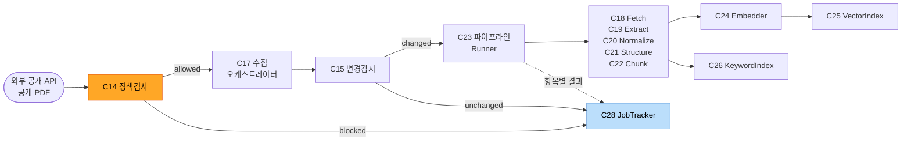
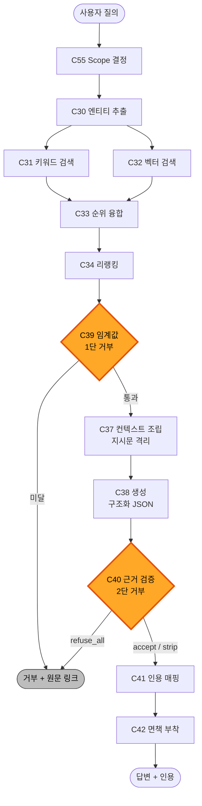

# Component Dependency — safeenv

**단계**: INCEPTION / Application Design
**작성일**: 2026-08-20

---

## 1. 계층 의존 규칙

```
L4  진입점        C56 WebRouters / C57 TemplateRenderer / C58 HealthCheck / C59 Worker / C60 CLI
                          |  (하향만 허용)
                          v
L3  서비스        S1 ~ S8
                          |
                          v
L2  도메인 컴포넌트  수집 C14~C17 / 처리 C18~C23 / 색인 C24~C27 / 작업 C28~C29
                     검색 C30~C35 / 생성 C36~C42 / 관측 C43 / 평가 C44~C48
                     카드 C49~C50 / 계정·문서 C51~C55
                          |
                          v
L1  포트·어댑터    C5~C8 (Protocol) <- C9~C12 (구현) <- C13 (데코레이터)
                          |
                          v
L0  공용 기반      C1 Config / C2 Logger / C3 Database / C4 Repositories
```

**규칙**

1. 상위 계층은 하위 계층에만 의존한다. **역방향 의존과 순환 의존은 금지**한다
2. L2 도메인 컴포넌트는 **다른 L2 컴포넌트를 직접 참조하지 않는다.**
   조합은 L3 서비스 또는 명시적 조립 컴포넌트(C23 `PipelineRunner`, C35 `RetrievalPipeline`)가 담당한다
3. L2 컴포넌트는 **L1 포트(추상)** 에만 의존하며 구현체(C9~C12)를 알지 못한다 (NFR-21)
4. C1 `Config` 와 C2 `Logger` 는 **모든 계층에서 참조 가능한 예외**다 (횡단 관심사)

---

## 2. 핵심 의존 관계

### 2.1 조립 컴포넌트

| 조립 컴포넌트 | 조립 대상 | 근거 |
|---|---|---|
| **C23** `PipelineRunner` | C18 → C19 → C20 → C21 → C22 | DQ-3=A 단계 체인 |
| **C35** `RetrievalPipeline` | C30, (C31 ∥ C32), C33, C34, C55 | DQ-5=B 독립 컴포넌트 조립 |

이 두 컴포넌트만이 동일 계층의 형제를 참조합니다. **의도된 예외**이며,
각각 "파이프라인 순서"와 "검색 구성"이라는 단일 책임을 갖습니다.

### 2.2 포트 사용 관계

| 포트 | 사용 컴포넌트 |
|---|---|
| **C5** `SourceAdapter` | C17 `IngestionOrchestrator`, C18 `FetchStage` |
| **C6** `LLMPort` | C38 `AnswerGenerator`, C47 `LLMJudge` |
| **C7** `EmbeddingPort` | C24 `Embedder`, C32 `VectorRetriever`(질의 임베딩) |
| **C8** `RerankerPort` | C34 `RerankStage` |

**C13 `TracingLLMDecorator`** 는 C6·C7·C8 구현을 감싸 조립 시점에 주입됩니다.
사용 컴포넌트는 데코레이터의 존재를 알지 못합니다 (DQ-16=A).

### 2.3 리포지터리 접근

| 리포지터리 | 접근 컴포넌트 |
|---|---|
| `SubstanceRepo` | C49, C50 |
| `DocumentRepo` | C15, C23, C27, C41, C55 |
| `ChunkRepo` | C22, C24, C25, C26, C35, C41 |
| `JobRepo` | C28 |
| `UserRepo` | C51, C52, S6 |
| `QueryLogRepo` | S3, S6 |
| `EvaluationRepo` | C48 |
| `TraceRepo` | C13(쓰기), C43(읽기) |

**규칙**: 검색·생성 컴포넌트는 DB 세션을 직접 받지 않고 리포지터리를 통해서만 접근합니다.
인메모리 스텁으로 대체 가능해야 하기 때문입니다 (NFR-24, NFR-28).

---

## 3. 유닛 간 의존 방향

```
u1 (수집·색인)  <---- u2 (질의응답)
   ^                  ^      ^
   |                  |      |
   +---- u3 (카드)    |      +---- u4 (평가)
   |                  |
   +---- u5 (계정·업로드) ----+
```

| 유닛 | 의존 대상 | 의존 내용 |
|---|---|---|
| **u1** | 없음 | 기반 유닛 |
| **u2** | u1 | 인덱스(C25, C26), 리포지터리, 포트, 설정 |
| **u4** | u2 (경유 u1) | `S3 QueryService`, `C35 RetrievalPipeline` |
| **u3** | u1, u2 | 구조화 데이터(C4), 인용 매핑(C41) |
| **u5** | u1, u2 | 처리 파이프라인(C23), 검색 스코프(C35) |

**실행 순서 검증** (`u1 → u2 → u4 → u3 → u5`):
각 유닛은 자신보다 **앞선 순서의 유닛에만** 의존합니다. **역방향 의존 0건** ✅

### 선행 유닛에 남기는 확장 지점

| 유닛 | 선행 유닛에 미리 두는 것 | 이유 |
|---|---|---|
| u5 → u1 | `Chunk.owner_id` 컬럼 (기본값 `NULL` = 공개) | 나중에 스키마 변경 없이 소유자 격리 도입 |
| u5 → u2 | `C35.retrieve()` 의 `scope` 인자 (u5 이전에는 "공개 전체") | 필터 누락이 구조적으로 불가능 |
| u3 → u1 | `substance_synonym` 테이블 | 수집 시점에 이명 데이터를 함께 적재 |

**설계 근거**: 방향 (a) 단계적 진행에서 후행 유닛이 선행 유닛의 스키마를 뒤늦게 바꾸면
재색인이 필요해집니다. 확장 지점을 u1·u2 설계 시점에 미리 뚫어 둡니다.

---

## 4. 데이터 흐름

### Flow A — 수집·색인 (u1, 비동기)



**Text Alternative**
```
외부 소스 -> C14 정책검사
   차단 -> C28 에 사유 기록하고 종료 (우회 없음)
   허용 -> C17 수집 -> C15 변경감지
             미변경 -> 건너뜀 (C28 기록)
             변경   -> C23 파이프라인
                        C18 Fetch -> C19 Extract -> C20 Normalize
                        -> C21 Structure -> C22 Chunk
                        -> C24 Embedder -> C25 VectorIndex
                        -> C26 KeywordIndex
   전 과정의 항목별 성공/실패는 C28 JobTracker 에 기록 (부분 성공 허용)
```

### Flow B — 질의응답 (u2, 동기) — **핵심 경로**



**Text Alternative**
```
사용자 질의
  -> C55 검색 범위 결정 (공개 코퍼스 + 본인 문서)
  -> C30 엔티티 추출 (물질명/CAS/UN -> 메타 필터)
  -> C31 키워드 검색  ||  C32 벡터 검색      (병렬)
  -> C33 순위 융합
  -> C34 리랭킹 (설정으로 비활성 가능)
  -> C39 [1단 거부] 스코어 임계값 판정
        미달 -> 거부 응답 + 원문 링크로 종료 (LLM 호출 없음)
        통과 -> C37 컨텍스트 조립 (문서를 데이터로 격리, NFR-16)
             -> C38 구조화 생성 {문장, 근거 ID}
             -> C40 [2단 거부] 근거 지지 검증
                   refuse_all -> 거부 응답
                   accept / strip_unsupported
                        -> C41 인용 매핑 (오프셋 -> 스니펫 + 원문 링크)
                        -> C42 면책 문구 부착
                        -> 답변 반환
LLM/임베딩/리랭커 호출은 C13 데코레이터가 전부 자동 계측
```

### Flow C — 평가 루프 (u4, 배치)

```
C44 골든셋 로드 -> 문항별 반복
    -> C35 RetrievalPipeline  -> C45 검색 지표 (Recall@k, MRR)
    -> S3 QueryService        -> C46 답변 지표 (정답률, 인용 정확도, 거부 정확도)
                              -> C47 LLM 심판 (충실도, 관련성)
    -> C48 결과 저장 (검색 구성 + 프롬프트 버전 함께 기록)
    -> C48 기준선 비교 -> 회귀 시 CLI 비0 종료 (NFR-26)

평가 경로가 S3 를 그대로 사용하므로 실사용 경로와 동일함이 보장된다
```

### Flow D — 문서 업로드 (u5)

```
업로드 -> C53 검증 (형식/크기/페이지)
       -> C54 저장 (웹루트 외부, 생성 식별자명)
       -> DocumentRepo.upsert(owner_id 부여)
       -> C29 큐 등록 -> [워커] -> S2 IndexingService (Flow A 의 파이프라인 재사용)
이후 검색 시 C55 가 owner_id 스코프를 강제하여 타 사용자에게 노출되지 않음
```

---

## 5. 의존 매트릭스 (요약)

행 = 의존하는 쪽, 열 = 의존받는 쪽. `X` = 직접 의존.

| | L0 기반 | L1 포트 | 수집 | 처리 | 색인 | 작업 | 검색 | 생성 | 카드 | 계정 | 평가 |
|---|---|---|---|---|---|---|---|---|---|---|---|
| **L4 진입점** | X | | | | | | | | | X | |
| **L3 서비스** | X | X | X | X | X | X | X | X | X | X | X |
| **평가 C44~48** | X | X | | | | | X* | | | | |
| **계정 C51~55** | X | | | | | | | | | | |
| **카드 C49~50** | X | | | | | | | X* | | | |
| **생성 C36~42** | X | X | | | | | | | | | |
| **검색 C30~35** | X | X | | | X | | | | | X* | |
| **작업 C28~29** | X | | | | | | | | | | |
| **색인 C24~27** | X | X | | X* | | | | | | | |
| **처리 C18~23** | X | X | | | | | | | | | |
| **수집 C14~17** | X | X | | | | X* | | | | | |
| **L1 포트** | X | | | | | | | | | | |
| **L0 기반** | | | | | | | | | | | |

`X*` 표시는 §2.1 조립 컴포넌트 또는 명시된 예외입니다.

- 수집 → 작업: C17 이 C28 에 진행 상황 보고
- 색인 → 처리: C27 `Reindexer` 가 C23 `PipelineRunner` 재실행
- 검색 → 계정: C35 가 C55 `OwnershipFilter` 의 `Scope` 를 인자로 수용 (u5 도입 후)
- 카드 → 생성: C50 이 C41 `CitationMapper` 재사용
- 평가 → 검색: C44~48 이 C35 를 직접 호출하여 구성별 비교 실험 수행

**하삼각 구조가 유지되므로 순환 의존 0건** ✅

---

## 6. 순환 의존성 검증

| 검증 항목 | 결과 |
|---|---|
| L0~L4 계층 간 역방향 의존 | **0건** |
| L2 도메인 컴포넌트 간 상호 참조 | **0건** (조립 컴포넌트 2개는 단방향) |
| 서비스 간 순환 호출 | **0건** (`S5→S3→S6`, `S7→S6` 단방향) |
| 유닛 간 역방향 의존 | **0건** (실행 순서와 정합) |
| 포트 구현체를 L2가 직접 참조 | **0건** (전부 추상 참조) |

---

## 7. NFR 반영 위치

| NFR | 반영 위치 |
|---|---|
| **NFR-2** 검색 P95 2.5초 | C35 `stage_timings` 로 구간 실측, C34 비활성 스위치 |
| **NFR-3** 카드 P95 1초 | C50 이 LLM 경로를 타지 않음 |
| **NFR-5** 인용 정확도 | C38 구조화 출력 → C40 검증 → C46 측정 |
| **NFR-6** 환각 0건 목표 | C39(1단) + C40(2단) 이중 방어 |
| **NFR-7** 임계값 조정 | C1 `get_thresholds()` 로 외부화 |
| **NFR-8** 추정 금지 | C50 이 결측 항목을 `None` 유지 |
| **NFR-10** 워커 확장 | C29 가 상태를 갖지 않음 (상태는 C28) |
| **NFR-11~13** 인증·업로드 | C51, C52, C53, C54 |
| **NFR-14** 비밀값 | C1 주입 + C2 마스킹 |
| **NFR-15** 접근 통제 | C55 를 C35 의 필수 인자로 |
| **NFR-16** 프롬프트 인젝션 | C37 데이터 영역 격리 |
| **NFR-19** 비용 추적 | C13 자동 계측 + C43 집계 |
| **NFR-21** 모델 교체 | C5~C8 포트 추상화 |
| **NFR-22** 프롬프트 버전 | C36 버전 식별자 + C48 기록 |
| **NFR-24/28** 테스트 | 리포지터리 경유 접근으로 스텁 대체 가능 |
| **NFR-26** 회귀 | C48 `check_regression()` + C60 종료코드 |
| **NFR-27** 속성 기반 테스트 | C16, C33, C39, C49 정규화 (순수 컴포넌트) |
