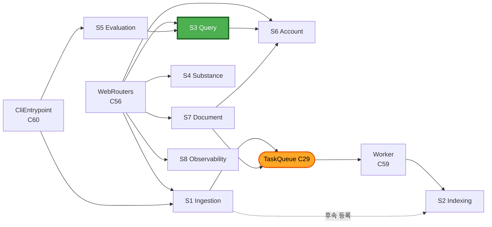

# Services — safeenv

**단계**: INCEPTION / Application Design
**작성일**: 2026-08-20

**계층 원칙** (DQ-12=A): **Thin router + Fat service**.
라우터(C56)는 입력 검증·직렬화·인증 확인만 수행하고, 모든 오케스트레이션은 서비스가 담당합니다.

**통신 원칙** (DQ-14=A): 서비스는 컴포넌트를 **직접 호출**(의존성 주입)하며,
**비동기 경계에서만 큐**(C29)를 사용합니다. 내부 이벤트 버스는 도입하지 않습니다.

---

## 서비스 목록

| ID | 서비스 | 책임 | 유닛 | 경로 유형 |
|---|---|---|---|---|
| **S1** | `IngestionService` | 수집 작업 시작·상태 조회 | u1 | 비동기 |
| **S2** | `IndexingService` | 문서 처리·색인 파이프라인 실행 | u1 | 비동기 |
| **S3** | `QueryService` | **질의응답 오케스트레이션 — 프로젝트 핵심** | u2 | 동기 |
| **S4** | `SubstanceService` | 물질 안전 카드 조회 | u3 | 동기 |
| **S5** | `EvaluationService` | 평가 실행·결과 조회 | u4 | 배치 |
| **S6** | `AccountService` | 가입·로그인·질의 이력·면책 동의 | u5 | 동기 |
| **S7** | `DocumentService` | 업로드·목록·삭제·재색인 | u5 | 동기 + 비동기 |
| **S8** | `ObservabilityService` | LLM 사용량·비용 조회 | u2 | 동기 |

---

## S1 `IngestionService` (u1)

**책임**: 소스별 수집 작업의 생성·실행·상태 조회

```python
start(source_id: str, since: datetime | None) -> JobId
job_status(job_id: JobId) -> JobProgress
list_sources() -> list[SourceInfo]     # 소스별 마지막 수집 시각·정책 상태
```

**오케스트레이션 — `start()`**

1. `C14 AccessPolicyChecker` 로 소스 정책 사전 검사 → 거부 시 **작업을 생성하지 않고** 사유 반환
2. `C28 JobTracker.create()` 로 작업 생성
3. `C29 TaskQueue.enqueue()` 로 워커에 위임 → **즉시 `JobId` 반환** (요청 스레드 비점유)
4. 워커에서 `C17 IngestionOrchestrator.run()` 실행
   - `C5.list_targets()` → `C15 ChangeDetector` 로 변경분 선별
   - 항목별 `C5.fetch()` → 실패 시 `C16 RetryPolicy` 판정
   - 항목 결과를 `C28.mark_item()` 으로 기록 (**부분 성공 허용**)
5. 수집 성공 문서마다 `S2 IndexingService` 작업을 후속 등록
6. `C28.finalize()` — 전건 실패면 `failed`, 일부 성공이면 `partial`

**트랜잭션 경계**: 문서 1건 = 1 트랜잭션. 작업 전체를 한 트랜잭션으로 묶지 않습니다
(장시간 락 방지 및 부분 성공 보존).

---

## S2 `IndexingService` (u1)

**책임**: 원본 문서를 청크·벡터·키워드 인덱스까지 반영

```python
process(document_ref: SourceRef, job_id: JobId) -> PipelineOutcome
reindex(document_id: int) -> PipelineOutcome
reindex_all(reason: str) -> JobId
```

**오케스트레이션 — `process()`**

1. `C23 PipelineRunner` 로 단계 체인 실행
   `C18 Fetch → C19 Extract → C20 Normalize → C21 Structure → C22 Chunk`
2. `C4 DocumentRepo.upsert()` — 문서 + 추출 텍스트(오프셋 포함) 저장
3. `C24 Embedder.embed_chunks()` → `C25 VectorIndex.upsert()`
4. `C26 KeywordIndex.upsert()`
5. 단계별 결과를 `C28` 에 기록. 실패 단계는 재개 지점으로 저장

**멱등성**: 같은 문서를 다시 처리하면 기존 청크·벡터를 삭제 후 재삽입합니다 (FR-13).

**⚠️ 트랜잭션 주의**: 벡터 인덱스와 키워드 인덱스는 **같은 PostgreSQL 트랜잭션**에 포함됩니다
(DQ-15=A, 단일 DB). 두 인덱스 간 불일치가 구조적으로 발생하지 않습니다.

---

## S3 `QueryService` (u2) — **프로젝트 핵심**

**책임**: 자연어 질의를 근거 기반 답변 또는 거부 응답으로 변환

```python
answer(query: str, user_id: int | None) -> QueryResult
```

**오케스트레이션 — `answer()`**

```
 1. 면책 동의 확인            S6.has_consented(user_id)     -> 미동의 시 동의 요구 응답
 2. 검색 범위 결정            C55 OwnershipFilter.scope_for(user_id)
 3. 근거 검색                 C35 RetrievalPipeline.retrieve(query, scope, config)
                                C30 엔티티 추출 -> 메타 필터
                                C31 키워드  ||  C32 벡터        (병렬)
                                C33 순위 융합
                                C34 리랭킹 (설정으로 on/off)
 4. [1단 거부] 판정           C39 RefusalPolicy.should_refuse(outcome)
                              -> refuse: 원문 링크만 담은 QueryResult 반환하고 종료 (LLM 미호출)
 5. 컨텍스트 조립             C37 ContextBuilder.build(query, evidences)   # 지시문 주입 차단
 6. 프롬프트 획득             C36 PromptRegistry.render("answer", ...)     # 버전 식별자 포함
 7. 답변 생성                 C38 AnswerGenerator.generate(...)            # 구조화 JSON
 8. [2단 거부] 근거 검증      C40 GroundingVerifier.verify(draft, evidences)
                              -> accept | strip_unsupported | refuse_all
 9. 인용 매핑                 C41 CitationMapper.map(...)  -> 스니펫 + 원문 링크
10. 면책 문구 부착            C42 DisclaimerProvider.answer_disclaimer()
11. 이력 저장                 C4 QueryLogRepo.save(...)    # 질문·답변·근거·프롬프트 버전
      (LLM 추적은 C13 데코레이터가 자동 기록 — 서비스는 관여하지 않음)
```

**설계 요점**

- **4단계에서 거부되면 LLM을 호출하지 않습니다.** 비용과 지연을 모두 절약하며, 이것이
  FR-20이 요구하는 동작입니다
- **8단계는 근거를 벗어난 문장을 걸러냅니다.** 4단계가 통과해도 모델이 이탈할 수 있으므로
  2단 방어가 필요합니다 (DQ-9=B)
- **FR-22(단발성)**: 이 서비스는 **무상태**입니다. 이전 질의를 참조하지 않으며,
  세션 컨텍스트를 인자로 받지 않습니다
- **NFR-1 성능**: 3단계(검색)와 7단계(생성)가 지연의 대부분입니다.
  `RetrievalOutcome.stage_timings` 로 구간별 실측이 가능합니다

---

## S4 `SubstanceService` (u3)

**책임**: 물질 안전 카드 조회

```python
get_card(term: str) -> SubstanceCard | NotFound
suggest(term: str) -> list[Substance]
```

**오케스트레이션 — `get_card()`**

1. `C49 SynonymResolver.resolve(term)` — 국문·영문·이명·CAS·UN 정규화 조회
2. 미일치 시 `C49.suggest()` 로 후보 반환
3. `C50 SubstanceCardAssembler.assemble(substance_id)` — **구조화 DB 직접 조회, LLM 미사용**
4. 항목별 출처 인용은 `C41 CitationMapper` 재사용

**설계 요점**: LLM을 거치지 않으므로 NFR-3(P95 1초)이 달성 가능하고, NFR-8(추정 금지)이
구조적으로 보장됩니다. 데이터가 없으면 값이 `None`이며 화면에서 "정보 없음"으로 렌더합니다.

---

## S5 `EvaluationService` (u4)

**책임**: 골든 QA 셋 기반 품질 평가 실행과 이력 관리

```python
run(golden_set_path: str, config: RetrievalConfig | None) -> EvaluationRun
list_runs(limit: int) -> list[EvaluationRunSummary]
compare(run_id: int, baseline_id: int | None) -> ComparisonReport
```

**오케스트레이션 — `run()`**

1. `C44 GoldenSetLoader.load()` + `validate()`
2. 문항별로:
   - `C35 RetrievalPipeline.retrieve()` → `C45 RetrievalMetrics.compute()`
   - `S3 QueryService.answer()` → `C46 AnswerMetrics.compute()`
   - `C47 LLMJudge.judge()` → 충실도·관련성
3. `C48 EvaluationReporter.save_run()` — 사용된 **검색 구성과 프롬프트 버전을 함께 기록**
4. `C48.compare()` + `check_regression()` — 기준선 미달 시 CLI가 비0 종료코드 반환 (NFR-26)

**설계 요점**

- `S5`가 `S3`를 **그대로 호출**합니다. 평가 경로와 실사용 경로가 동일해야 평가가 의미를 가집니다
- 검색 구성(`RetrievalConfig`)을 인자로 받으므로 **리랭커 on/off, 후보 수 K 변경에 따른
  품질 비교 실험**이 가능합니다 (DQ-5=B의 목적)

---

## S6 `AccountService` (u5)

**책임**: 계정, 인증, 면책 동의, 질의 이력

```python
register(email: str, password: str) -> User
login(email: str, password: str) -> Token
record_consent(user_id: int) -> None
has_consented(user_id: int | None) -> bool
query_history(user_id: int, limit: int, offset: int) -> list[QueryLog]
```

**오케스트레이션**

- `register()`: `C51 PasswordHasher.validate_policy()` → `hash()` → `C4 UserRepo`
- `login()`: `C51.verify()` → `C52 TokenService.issue()`
- `has_consented()`: 미인증 사용자는 세션 쿠키 기반으로 판정 (FR-34)

---

## S7 `DocumentService` (u5)

**책임**: 사용자 업로드 문서의 수명주기

```python
upload(file: UploadFile, user_id: int) -> tuple[int, JobId]
list(user_id: int) -> list[UserDocument]
delete(document_id: int, user_id: int) -> None
reindex(document_id: int, user_id: int) -> JobId
```

**오케스트레이션 — `upload()`**

1. `C53 UploadValidator.validate()` — 실패 시 즉시 거부
2. `C54 UploadStore.save()` — 웹 루트 외부, 생성 식별자 이름
3. `C4 DocumentRepo.upsert()` — `owner_id` 부여
4. `C28 JobTracker.create()` + `C29 TaskQueue.enqueue()` → `S2 IndexingService.process()` 위임
5. `(document_id, job_id)` 반환 — 화면은 작업 진행률을 폴링

**삭제 — `delete()`**: `C55.assert_owner()` 선행 → 청크·벡터·키워드 인덱스·저장 파일을
**같은 트랜잭션에서 제거** (FR-29)

---

## S8 `ObservabilityService` (u2)

**책임**: LLM 사용량·비용 조회

```python
summary(period: DateRange, group_by: str) -> UsageSummary
recent_calls(limit: int) -> list[TraceRecord]
```

`C43 UsageReporter` 를 호출합니다. 기록은 `C13` 데코레이터가 자동 수행하므로
이 서비스는 **조회 전용**입니다.

---

## 서비스 상호작용



### Text Alternative

```
진입점 -> 서비스
  WebRouters  -> S1 Ingestion, S3 Query, S4 Substance, S6 Account, S7 Document, S8 Observability
  CliEntrypoint -> S1 Ingestion, S5 Evaluation
  Worker      -> S2 Indexing

서비스 간 호출 (동기)
  S3 Query      -> S6 Account        (면책 동의 확인)
  S5 Evaluation -> S3 Query          (평가 경로 = 실사용 경로)
  S7 Document   -> S6 Account        (소유자 확인)

서비스 간 위임 (비동기, TaskQueue 경유)
  S1 Ingestion -> [Queue] -> S2 Indexing
  S7 Document  -> [Queue] -> S2 Indexing

순환 호출: 없음
```

---

## 서비스 설계 규칙

1. **서비스는 다른 서비스를 호출할 수 있으나 순환은 금지**한다. 현재 호출 방향은
   `S5 → S3 → S6`, `S7 → S6`, `S1/S7 → (큐) → S2` 로 단방향이다
2. **트랜잭션 경계는 서비스가 소유**한다. 컴포넌트는 세션을 열지 않는다
3. **긴 작업은 서비스에서 큐로 위임**하고 즉시 `JobId` 를 반환한다 — 요청 스레드를 점유하지 않는다
4. **서비스는 HTTP 개념(요청·응답 객체, 상태 코드)을 알지 못한다** — 라우터가 변환한다
5. **`S3 QueryService` 는 무상태**다 (FR-22). 멀티턴이 필요해지면 이 서비스 위에
   별도의 대화 서비스를 얹는 방식으로 확장한다 (현재 OOS-3)
