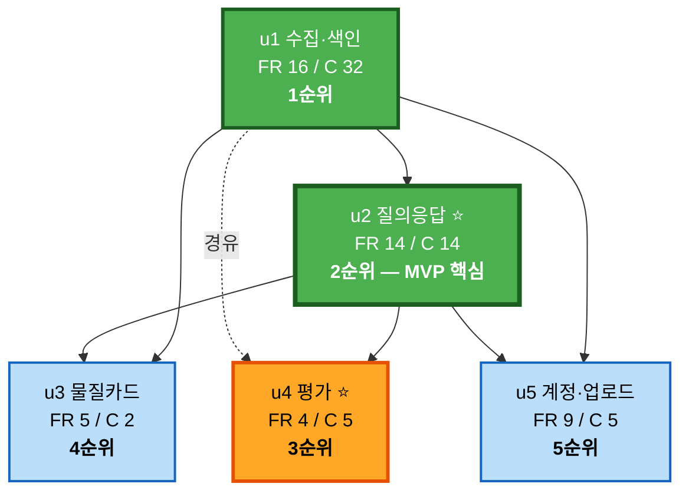

# Unit of Work Dependency — safeenv

**단계**: INCEPTION / Units Generation — Part 2 (Generation)
**작성일**: 2026-08-20

---

## 1. 의존 매트릭스

행 = 의존하는 유닛, 열 = 의존받는 유닛. `X` = 직접 의존, `–` = 없음.

| | u1 수집·색인 | u2 질의응답 | u4 평가 | u3 카드 | u5 계정·업로드 |
|---|---|---|---|---|---|
| **u1** 수집·색인 | — | – | – | – | – |
| **u2** 질의응답 | **X** | — | – | – | – |
| **u4** 평가 | X *(경유)* | **X** | — | – | – |
| **u3** 카드 | **X** | **X** | – | — | – |
| **u5** 계정·업로드 | **X** | **X** | – | – | — |

**상삼각이 전부 비어 있으므로 역방향 의존 0건** ✅

---

## 2. 의존 내용

| 의존 | 대상 | 구체적 내용 |
|---|---|---|
| **u2 → u1** | C25 `VectorIndex`, C26 `KeywordIndex` | 검색 대상 인덱스 |
| | C4 `Repositories` | 청크·문서·추출텍스트 조회 |
| | C6 `LLMPort`, C8 `RerankerPort` | 생성·재정렬 포트 |
| | C1 `Config`, C2 `Logger` | 설정·로깅 |
| **u4 → u2** | S3 `QueryService` | 평가 경로 = 실사용 경로 (DD-22) |
| | C35 `RetrievalPipeline` | 검색 지표 산출 및 구성별 비교 실험 |
| | C6 `LLMPort` | LLM-as-judge |
| **u4 → u1** *(경유)* | C4 `Repositories` | 평가 결과 영속화 |
| **u3 → u1** | C4 `SubstanceRepo` | 구조화 물질 데이터 |
| | `substance_synonym` 테이블 | 동의어 조회 (**u1 리비전에 선반영**) |
| **u3 → u2** | C41 `CitationMapper` | 카드 항목별 출처 표기 재사용 |
| **u5 → u1** | C23 `PipelineRunner` | 업로드 문서 처리에 동일 파이프라인 재사용 |
| | C28 `JobTracker`, C29 `TaskQueue` | 업로드 처리 비동기화 |
| | `chunk.owner_id` 컬럼 | 소유자 격리 (**u1 리비전에 선반영**) |
| **u5 → u2** | C35 `RetrievalPipeline` 의 `scope` 인자 | 소유자 스코프 적용 (**u2에서 필수 인자로 이미 존재**) |

---

## 3. 실행 순서 정합성 검증

**확정 순서**: `u1 → u2 → u4 → u3 → u5` (UD-2)

| 유닛 | 실행 시점 | 의존 대상 | 의존 대상의 실행 시점 | 판정 |
|---|---|---|---|---|
| u1 | 1 | 없음 | — | ✅ |
| u2 | 2 | u1 | 1 | ✅ |
| u4 | 3 | u2, u1 | 2, 1 | ✅ |
| u3 | 4 | u1, u2 | 1, 2 | ✅ |
| u5 | 5 | u1, u2 | 1, 2 | ✅ |

**모든 유닛이 자신보다 앞선 순서의 유닛에만 의존합니다.** 순환 없음, 역방향 없음.

### u3 와 u4 의 순서 교환 가능성

u3(카드)와 u4(평가)는 **서로 의존하지 않습니다.** 따라서 순서 교환이 기술적으로 가능합니다.
UD-2가 u4를 앞에 둔 것은 기술적 제약이 아니라 **품질 회귀 감지를 조기에 확보**하기 위한
전략적 선택입니다. 진행 중 우선순위가 바뀌면 교환해도 무방합니다.

---

## 4. 선행 유닛에 선반영하는 확장 지점 (DD-21, UD-6)

후행 유닛이 선행 유닛의 스키마·시그니처를 뒤늦게 바꾸면 **전체 재색인**이 발생합니다.
아래 항목은 사용 시점보다 앞서 도입합니다.

| 선반영 항목 | 도입 유닛 | 실제 사용 유닛 | 미리 두지 않으면 |
|---|---|---|---|
| `chunk.owner_id` (nullable, 기본 `NULL` = 공개) | **u1** | u5 | 수십만 청크에 `ALTER TABLE` + 재색인 |
| `substance_synonym` 테이블 | **u1** | u3 | 이명 데이터 재수집 필요 |
| `C35.retrieve()` 의 `scope` 필수 인자 | **u2** | u5 | 검색 시그니처 변경 → 호출부 전면 수정 |
| `RetrievalConfig` 를 인자로 받는 검색 진입점 | **u2** | u4 | 구성별 비교 실험 불가 |
| `QueryLog` 에 프롬프트 버전·검색 구성 기록 | **u2** | u4 | 품질 변화 원인 추적 불가 |

**u1·u2 시점에는 사용되지 않는 코드가 일부 존재합니다.** 이는 의도된 것이며,
Functional Design에서 "u5/u4 대비 확장 지점"으로 명시합니다.

---

## 5. 유닛 의존 그래프



### Text Alternative

```
u1 수집·색인  (의존 없음, 기반)
   |
   +--> u2 질의응답      (u1 의존)          <- MVP 핵심, 최소 목표
   |       |
   |       +--> u4 평가   (u2, u1 의존)     <- 권장 목표
   |
   +--> u3 물질카드      (u1, u2 의존)
   |
   +--> u5 계정·업로드   (u1, u2 의존)

u3 와 u4 사이에는 의존이 없어 순서 교환이 가능하다.
역방향 의존: 0건.  순환: 없음.
```

---

## 6. 중단 가능 지점과 잔여 상태

각 유닛 완료 시점에서 시스템이 어떤 상태인지, 그리고 다음 유닛 없이도 성립하는지입니다.

| 완료 시점 | 동작하는 것 | 동작하지 않는 것 | 단독 성립 |
|---|---|---|---|
| **u1** | 수집·색인 파이프라인, 작업 진행률 화면, 헬스체크 | 검색·답변 화면 없음 | ⚠️ 부분 — 사용자 대면 기능 없음 |
| **u2** ⭐ | **질의 → 인용 답변 / 근거 부족 시 거부**, LLM 사용량 조회 | 품질 수치 없음, 카드 없음, 계정 없음 | ✅ **완결** |
| **u4** ⭐ | + 품질 리포트, 회귀 감지 | 카드 없음, 계정 없음 | ✅ **완결** |
| **u3** | + 물질 안전 카드 | 계정·업로드 없음 | ✅ 완결 |
| **u5** | + 계정, 업로드, 질의 이력 | — | ✅ 완결 (전체) |

**u1 단독은 사용자 대면 기능이 없어 포트폴리오로 약합니다.**
따라서 **u2까지를 최소 목표(6~8주)** 로 삼습니다.

---

## 7. 유닛 간 통합 규칙 (UD-5)

1. 유닛 간 통합은 **직접 import**로 하되, `application-design/component-dependency.md` §1의
   **계층 규칙을 반드시 준수**한다 (L4 → L3 → L2 → L1 → L0)
2. 후행 유닛이 선행 유닛의 **공개 인터페이스만** 사용한다. 내부 구현 세부에 의존하지 않는다
3. 후행 유닛이 선행 유닛의 **시그니처를 변경해야 한다면** 그것은 §4 선반영 목록의 누락이며,
   해당 시점에 Functional Design 문서를 갱신하고 사유를 `audit.md`에 기록한다
4. 유닛 완료 후에는 선행 유닛의 테스트가 **계속 통과해야 한다** (회귀 방지)
