# Execution Plan — safeenv

**프로젝트**: safeenv — 화학 안전·규제 근거 기반 질의응답(RAG) 시스템
**작성일**: 2026-08-20
**진행 방향**: **(a) 단계적 진행** — 사용자 선택 2026-08-20
**상태**: 사용자 승인 대기

---

## 1. Detailed Analysis Summary

### 1.1 Change Impact Assessment

| 영역 | 해당 | 내용 |
|---|---|---|
| **User-facing changes** | Yes | 질의 화면, 물질 카드, 문서 관리, 질의 이력, 운영 화면 (FR-44~48) |
| **Structural changes** | Yes | 신규 시스템 전체 구축 — 수집 / 인덱싱 / 검색·생성 / 평가 / 인증 계층 |
| **Data model changes** | Yes | 물질·법령·사고사례·문서·청크·벡터·사용자·질의이력·평가결과 스키마 신규 |
| **API changes** | Yes | 전체 신규 — 질의, 물질 조회, 업로드, 인증, 작업 상태, 추적 조회 |
| **NFR impact** | Yes | 성능(NFR-1~4), 정확성(NFR-5~8), 보안(NFR-11~18, Security Baseline 활성), 비용(NFR-19~20) |

### 1.2 Risk Assessment

| 항목 | 평가 |
|---|---|
| **Risk Level** | **Medium-High** |
| **Rollback Complexity** | Easy — Greenfield, 로컬 실행, 운영 중 데이터 없음 |
| **Testing Complexity** | **Complex** — RAG 품질은 결정론적 단위 테스트로 검증 불가. 평가셋 기반 통계적 검증 필요 |

**주요 위험** (requirements.md §9 전문 참조)
- **R-7 범위 총량** (FR 48 / NFR 32, 3~4개월 분량) → **본 실행 계획의 유닛 분해로 완화**
- **R-2 MSDS PDF 파싱 실패율** → u1에서 파싱 성공률을 지표화
- **R-4 리랭커 지연이 NFR-1·2와 충돌** → u2에서 리랭커 on/off 스위치 및 후보 수 설정화
- **R-6 안전 정보 오답의 실제 위험** → u2의 거부 로직 + 면책 고지 이중 방어

---

## 2. Workflow Visualization

```mermaid
flowchart TD
    Start(["User Request"])

    subgraph INCEPTION["🔵 INCEPTION PHASE"]
        WD["Workspace Detection<br/><b>COMPLETED</b>"]
        RE["Reverse Engineering<br/><b>SKIP</b>"]
        RA["Requirements Analysis<br/><b>COMPLETED</b>"]
        US["User Stories<br/><b>SKIP</b>"]
        WP["Workflow Planning<br/><b>IN PROGRESS</b>"]
        AD["Application Design<br/><b>EXECUTE</b>"]
        UG["Units Generation<br/>(Planning + Generation)<br/><b>EXECUTE</b>"]
    end

    subgraph CONSTRUCTION["🟢 CONSTRUCTION PHASE — 유닛별 반복 x5"]
        FD["Functional Design<br/><b>EXECUTE</b> (5 units)"]
        NFRA["NFR Requirements<br/><b>SKIP</b>"]
        NFRD["NFR Design<br/><b>EXECUTE</b> (u2, u5)"]
        ID["Infrastructure Design<br/><b>EXECUTE</b> (u1)"]
        CG["Code Generation<br/>(Planning + Generation)<br/><b>EXECUTE</b> (5 units)"]
        BT["Build and Test<br/><b>EXECUTE</b> (유닛별 + 통합)"]
    end

    subgraph OPERATIONS["🟡 OPERATIONS PHASE"]
        OPS["Operations<br/><b>PLACEHOLDER</b>"]
    end

    Start --> WD
    WD --> RE
    RE --> RA
    RA --> US
    US --> WP
    WP --> AD
    AD --> UG
    UG --> FD
    FD --> NFRA
    NFRA --> NFRD
    NFRD --> ID
    ID --> CG
    CG -->|Next Unit| FD
    CG --> BT
    BT --> OPS
    OPS --> End(["Complete"])

    style WD fill:#4CAF50,stroke:#1B5E20,stroke-width:3px,color:#fff
    style RA fill:#4CAF50,stroke:#1B5E20,stroke-width:3px,color:#fff
    style WP fill:#4CAF50,stroke:#1B5E20,stroke-width:3px,color:#fff
    style CG fill:#4CAF50,stroke:#1B5E20,stroke-width:3px,color:#fff
    style BT fill:#4CAF50,stroke:#1B5E20,stroke-width:3px,color:#fff
    style RE fill:#BDBDBD,stroke:#424242,stroke-width:2px,stroke-dasharray: 5 5,color:#000
    style US fill:#BDBDBD,stroke:#424242,stroke-width:2px,stroke-dasharray: 5 5,color:#000
    style NFRA fill:#BDBDBD,stroke:#424242,stroke-width:2px,stroke-dasharray: 5 5,color:#000
    style AD fill:#FFA726,stroke:#E65100,stroke-width:3px,stroke-dasharray: 5 5,color:#000
    style UG fill:#FFA726,stroke:#E65100,stroke-width:3px,stroke-dasharray: 5 5,color:#000
    style FD fill:#FFA726,stroke:#E65100,stroke-width:3px,stroke-dasharray: 5 5,color:#000
    style NFRD fill:#FFA726,stroke:#E65100,stroke-width:3px,stroke-dasharray: 5 5,color:#000
    style ID fill:#FFA726,stroke:#E65100,stroke-width:3px,stroke-dasharray: 5 5,color:#000
    style OPS fill:#BDBDBD,stroke:#424242,stroke-width:2px,stroke-dasharray: 5 5,color:#000
    style INCEPTION fill:#BBDEFB,stroke:#1565C0,stroke-width:3px,color:#000
    style CONSTRUCTION fill:#C8E6C9,stroke:#2E7D32,stroke-width:3px,color:#000
    style OPERATIONS fill:#FFF59D,stroke:#F57F17,stroke-width:3px,color:#000
    style Start fill:#CE93D8,stroke:#6A1B9A,stroke-width:3px,color:#000
    style End fill:#CE93D8,stroke:#6A1B9A,stroke-width:3px,color:#000

    linkStyle default stroke:#333,stroke-width:2px
```



### Text Alternative (항상 포함)

```
INCEPTION PHASE
  1. Workspace Detection ........ COMPLETED  (2026-08-20)
  2. Reverse Engineering ........ SKIP       (Greenfield)
  3. Requirements Analysis ...... COMPLETED  (2026-08-20, FR 48 / NFR 32)
  4. User Stories ............... SKIP       (단일 페르소나)
  5. Workflow Planning .......... IN PROGRESS
  6. Application Design ......... EXECUTE
  7. Units Generation ........... EXECUTE

CONSTRUCTION PHASE  (유닛 u1 -> u2 -> u4 -> u3 -> u5 순으로 반복)
  8.  Functional Design ......... EXECUTE  (전 5개 유닛)
  9.  NFR Requirements .......... SKIP     (NFR·스택 확정 완료)
  10. NFR Design ................ EXECUTE  (u2, u5 만)
  11. Infrastructure Design ..... EXECUTE  (u1 에서 전체 토폴로지 확립)
  12. Code Generation ........... EXECUTE  (전 5개 유닛)
  13. Build and Test ............ EXECUTE  (유닛 완료 시마다 + 최종 통합)

OPERATIONS PHASE
  14. Operations ................ PLACEHOLDER
```

---

## 3. 유닛 분해 (제안) — 방향 (a) 단계적 진행의 핵심

**원칙**: 각 유닛은 **그 시점에서 멈춰도 동작하고 시연 가능한 결과물**을 남긴다.

> 아래는 **제안**이며, Units Generation 단계에서 `unit-of-work.md`, `unit-of-work-dependency.md`,
> `unit-of-work-story-map.md` 로 확정됩니다.

### u1 — `u1-ingestion-index` : 수집 · 문서처리 · 인덱싱 (기반)

| 항목 | 내용 |
|---|---|
| **포함 FR** | FR-1~13 (수집 4종, 정책 준수, 큐, 증분, 정규화, 청킹, 임베딩, 키워드 인덱스, 재색인), FR-40 로깅, FR-43 헬스체크, FR-48 운영 화면(작업 상태 부분) |
| **포함 NFR** | NFR-4 인덱싱 처리량, NFR-9 규모, NFR-10 워커 확장, NFR-14 비밀값, NFR-17 입력검증, NFR-23 설정 외부화, NFR-29~31 컨테이너·볼륨 |
| **기반 요소** | DB 스키마 전체, 설정 체계, 작업 큐 인프라, Docker Compose 토폴로지 |
| **완료 시점의 데모** | "물질 1,000종의 MSDS·법령·사고사례가 색인되어 있고, 수집 작업 상태를 화면에서 볼 수 있다" |
| **의존** | 없음 |
| **예상 기간** | 3~4주 |

### u2 — `u2-rag-qa` : 검색 · 답변 생성 · 인용 **(MVP 중심)**

| 항목 | 내용 |
|---|---|
| **포함 FR** | FR-14~22 (질의 접수, 하이브리드 검색, 리랭킹, 엔티티 필터, 근거 기반 생성, 인용, 거부, 사후 검증, 단발성), FR-34·35 면책 고지, FR-41·42 LLM 추적, FR-44 질의 화면 |
| **포함 NFR** | NFR-1·2 응답 성능, NFR-5~8 정확성, NFR-16 프롬프트 인젝션 방어, NFR-19 비용 추적, NFR-21·22 추상화·프롬프트 관리 |
| **완료 시점의 데모** | **"질문하면 출처가 붙은 답변이 나오고, 근거가 없으면 거부한다"** — 프로젝트의 핵심 가치가 이 시점에 완성 |
| **의존** | u1 (인덱스) |
| **예상 기간** | 3~4주 |

### u4 — `u4-evaluation` : 품질 평가 하네스 *(순서상 3번째로 실행)*

| 항목 | 내용 |
|---|---|
| **포함 FR** | FR-36~39 (골든 QA 셋, 검색·답변 지표, LLM-as-judge, 이력 비교), FR-48 운영 화면(평가 결과 부분) |
| **포함 NFR** | NFR-26 평가셋 회귀 테스트, NFR-5·6 정확성 목표의 측정 수단 |
| **완료 시점의 데모** | "검색 Recall@k, 인용 정확도, 충실도 점수가 수치로 나오고 이전 실행과 비교된다" |
| **의존** | u2 (평가 대상) |
| **예상 기간** | 2주 |
| **⚠️ 순서 근거** | 아래 §3.1 참조 |

### u3 — `u3-substance-card` : 물질 안전 카드 *(순서상 4번째로 실행)*

| 항목 | 내용 |
|---|---|
| **포함 FR** | FR-23~26 (카드 조회, 카드 항목, 항목별 출처, 동의어 검색), FR-45 카드 화면 |
| **포함 NFR** | NFR-3 카드 조회 성능, NFR-8 추정 금지 |
| **완료 시점의 데모** | "CAS 번호를 넣으면 GHS 분류·보호구·응급조치·적용 법령 카드가 출처와 함께 나온다" |
| **의존** | u1 (구조화 데이터), u2 (인용 표시 방식 재사용) |
| **예상 기간** | 1~2주 |

### u5 — `u5-account-upload` : 계정 · 문서 업로드

| 항목 | 내용 |
|---|---|
| **포함 FR** | FR-27~33 (업로드·격리·관리·검증, 회원가입·로그인, 질의 이력), FR-46 문서 관리 화면, FR-47 이력 화면 |
| **포함 NFR** | NFR-11~15 보안(해싱, JWT, 파일 저장, 비밀값, 접근 통제) |
| **완료 시점의 데모** | "로그인해서 내 MSDS PDF를 올리면 나에게만 검색된다" |
| **의존** | u1 (파싱·인덱싱 재사용), u2 (검색 시 소유자 필터) |
| **예상 기간** | 2주 |

### 3.1 실행 순서와 그 근거

```
u1 (수집·색인)  ->  u2 (질의응답)  ->  u4 (평가)  ->  u3 (물질 카드)  ->  u5 (계정·업로드)
   기반 3~4주        핵심 3~4주        하네스 2주      2순위 1~2주        부가 2주
```

**u4(평가)를 u3(물질 카드)보다 먼저 두는 이유**: 평가 하네스를 u2 직후에 세우면,
그 이후의 모든 변경(카드 추가, 업로드 도입, 프롬프트 수정, 모델 교체)에 대해
**품질 회귀를 즉시 수치로 감지**할 수 있습니다. 하네스가 늦어지면 "언제 나빠졌는지"를
사후에 추적할 수 없습니다. 또한 채용 관점에서 가장 차별화되는 산출물이므로 조기 확보가 유리합니다.

**2순위 기능인 u3(물질 카드)를 뒤로 미루는 이유**: 사용자 가치는 크지만 u1의 구조화 데이터를
조회·표시하는 작업이 대부분이라 기술적 위험이 낮습니다. 위험이 높은 유닛을 앞에 배치합니다.

### 3.2 중단 가능 지점

| 중단 시점 | 남는 결과물 | 포트폴리오로서의 가치 |
|---|---|---|
| u1 완료 | 3종 코퍼스 수집·파싱·색인 파이프라인 + 작업 큐 | 데이터 엔지니어링 역량 증명 (화면 없음) |
| **u2 완료** | **근거 인용 RAG 질의응답 시스템** | **단독으로 완결된 포트폴리오. 여기까지가 최소 목표** |
| u4 완료 | + 자동 품질 평가 리포트 | **차별화 최대 지점.** 권장 목표 |
| u3 완료 | + 물질 안전 카드 | 도메인 특화 UI 확보 |
| u5 완료 | + 계정·업로드 | 백엔드 종합 역량 |

---

## 4. Phases to Execute

### 🔵 INCEPTION PHASE

- [x] **Workspace Detection** — COMPLETED (2026-08-20)
- [x] **Reverse Engineering** — **SKIP**
  - **Rationale**: Greenfield. 분석할 기존 코드 없음
- [x] **Requirements Analysis** — COMPLETED (2026-08-20)
  - 산출물: `inception/requirements/requirements.md` (FR 48 / NFR 32 / CON 8 / OOS 10 / SC 8 / R 7)
- [x] **User Stories** — **SKIP**
  - **Rationale**: 페르소나가 "화학물질 취급자" 단일(Q3=D)이며, FR 48건이 이미 수용 기준 수준으로
    상세하게 기술되어 있음. 스토리로 재작성해도 새로운 정보가 생기지 않음
- [x] **Workflow Planning** — IN PROGRESS (본 문서)
- [ ] **Application Design** — **EXECUTE**
  - **Rationale**: 신규 컴포넌트가 다수 필요함 — 수집 어댑터, 문서 파서, 청커, 임베더, 하이브리드
    검색기, 리랭커, 인용 매퍼, 거부 판정기, 평가 러너, LLM 추적기 등. 컴포넌트 경계와 의존 방향,
    LLM·임베딩 추상화 인터페이스(NFR-21)를 코드 작성 전에 확정해야 함. 잔여 라이브러리 선정도
    이 단계의 설계 결정(DD)으로 확정
- [ ] **Units Generation** — **EXECUTE**
  - **Rationale**: **방향 (a) 단계적 진행의 실행 수단.** §3의 5개 유닛 분해를 확정하고
    유닛 간 의존 관계와 FR 매핑을 문서화. R-7(범위 총량) 완화의 핵심 장치

### 🟢 CONSTRUCTION PHASE — 유닛별 반복

- [ ] **Functional Design** — **EXECUTE** (전 5개 유닛)
  - **Rationale**: 비즈니스 규칙이 무겁고 정확성이 요구사항의 핵심임. 청킹 경계 규칙, 하이브리드
    스코어 융합식, 거부 임계값 판정, 인용-근거 매핑 규칙, MSDS 16섹션 매핑, 법령 조·항·호 분해
    규칙 등은 코드로 바로 가면 반드시 재작업이 발생
- [ ] **NFR Requirements** — **SKIP** (전 유닛)
  - **Rationale**: NFR 32건과 기술 스택 12개 계층이 Requirements Analysis에서 이미 확정됨
    (requirements.md §4, §12). 잔여 라이브러리 선정은 Application Design의 설계 결정으로 흡수
- [ ] **NFR Design** — **EXECUTE (u2, u5)** / **SKIP (u1, u3, u4)**
  - **Rationale (EXECUTE)**: Security Baseline 확장이 활성(Q27=A). u2는 프롬프트 인젝션
    방어(NFR-16) — 검색 문서를 데이터로만 취급하는 구조적 분리 설계가 필요. u5는 인증·업로드
    통제(NFR-11~15) — 해싱, 토큰 수명, 파일 저장 위치, 소유자 격리의 논리 컴포넌트 설계가 필요
  - **Rationale (SKIP)**: u1·u3·u4는 위 두 유닛에서 확립된 보안 패턴을 상속만 하며
    고유한 NFR 설계 결정이 없음
- [ ] **Infrastructure Design** — **EXECUTE (u1)** / **SKIP (u2~u5)**
  - **Rationale (EXECUTE)**: u1에서 전체 Compose 토폴로지를 확립 — app / worker / PostgreSQL+pgvector
    / 큐 백엔드 컨테이너, 볼륨(DB·업로드·모델 캐시), 포트 `127.0.0.1:8200`(CON-2), 비루트 실행,
    헬스체크, 환경변수 체계
  - **Rationale (SKIP)**: u2~u5는 애플리케이션 계층 추가이며 인프라 변경이 없음.
    변경이 발생하면 u1의 인프라 문서에 델타로 추가 기록
- [ ] **Code Generation** — **EXECUTE** (ALWAYS, 전 5개 유닛)
  - **Rationale**: 구현 계획 수립 및 코드 생성
- [ ] **Build and Test** — **EXECUTE** (ALWAYS)
  - **Rationale**: 빌드·테스트·검증
  - **⚠️ 방향 (a)에 따른 적용 조정**: 표준 워크플로는 전 유닛 완료 후 1회 실행이나,
    "어디서 멈춰도 동작하는 결과물"이라는 목표를 만족시키기 위해
    **각 유닛 완료 시마다 증분 Build & Test를 실행**하고, 최종적으로 통합 Build & Test를 1회 수행

### 🟡 OPERATIONS PHASE

- [ ] **Operations** — PLACEHOLDER
  - **Rationale**: 향후 배포·모니터링 워크플로용 자리표시자. 본 프로젝트에서는 운영 문서 색인 역할

---

## 5. Estimated Timeline

| 구분 | 값 |
|---|---|
| **표준 스테이지 총수** | 14 |
| **완료** | 3 (Workspace Detection, Requirements Analysis, Workflow Planning) |
| **SKIP** | 3 (Reverse Engineering, User Stories, NFR Requirements) |
| **실행 예정** | 8 (Application Design, Units Generation, Functional Design, NFR Design, Infrastructure Design, Code Generation, Build and Test, Operations) |
| **CONSTRUCTION 유닛 수** | **5** (u1, u2, u4, u3, u5) |
| **예상 개발 기간** | **11~14주 (약 3~3.5개월)** — u1 3~4주 + u2 3~4주 + u4 2주 + u3 1~2주 + u5 2주 |
| **최소 목표 (u2까지)** | **6~8주** — 단독 완결된 포트폴리오 확보 시점 |
| **권장 목표 (u4까지)** | **8~10주** — 차별화 지점(자동 평가) 확보 시점 |

---

## 6. Success Criteria

**Primary Goal**: 화학 안전·규제 문서를 근거로, **출처가 추적되고 근거가 없으면 거부하는**
질의응답 시스템을 구축하여 화학공학 도메인 지식과 백엔드·AI 엔지니어링 역량을 동시에 증명한다.

**Key Deliverables**
1. 3종 코퍼스(MSDS / 법령 / 사고사례) 수집·파싱·인덱싱 파이프라인
2. 하이브리드 검색 + 리랭커 기반 RAG 질의응답 API 및 화면
3. 문장 단위 인용 및 근거 부족 시 거부 로직
4. 골든 QA 셋 기반 자동 품질 평가 리포트
5. 물질 안전 카드 조회
6. 계정 및 사용자 문서 업로드
7. LLM 호출 비용·지연 추적
8. Docker Compose 단일 명령 기동 구성

**Quality Gates**

| ID | 게이트 | 검증 시점 |
|---|---|---|
| **QG-1** | FR·NFR 미매핑 0건 (추적성 유지) | 각 유닛 Code Generation |
| **QG-2** | 애플리케이션 코드가 `aidlc-docs/` 밖에만 존재 | 각 유닛 Code Generation |
| **QG-3** | 단위 테스트 전건 통과, 네트워크 비의존 | 각 유닛 Build & Test |
| **QG-4** | 인용 정확도 ≥ 95% (NFR-5) | u4 이후 매 유닛 |
| **QG-5** | 근거 불충분 질문의 정확한 거부율 측정 (SC-3) | u4 이후 매 유닛 |
| **QG-6** | Security Baseline 차단성 findings 0건 | u2, u5 NFR Design 및 Code Generation |
| **QG-7** | `docker compose up` 단일 명령 기동 실측 (NFR-29) | u1 및 최종 통합 Build & Test |
| **QG-8** | 비밀값이 로그·저장소에 노출되지 않음 (NFR-14) | u2, u5 Build & Test |

---

## 7. 다음 스테이지

**Application Design** — 컴포넌트 식별, 컴포넌트별 메서드, 서비스 계층, 컴포넌트 의존 관계 설계.
산출물은 `inception/application-design/` 에 생성됩니다.
